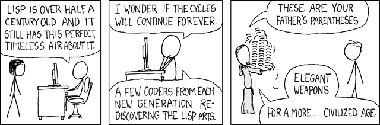

# Arrival

**A sandboxed R7RS-subset Scheme for LLM agents that need to compute, not just call tools.**



Lisp was born in 1958 for AI research — the first language built *for* AI. arrival is a
Lisp dialect built for AI *as the user*: the agent writes the programs.
([xkcd 297](https://xkcd.com/297/) by Randall Munroe, [CC BY-NC 2.5](https://creativecommons.org/licenses/by-nc/2.5/).)

This repository is the public home of the `@inhuman.tools/arrival*` family, published by
[here.build](https://here.build). Shared floor packages (`@here.build/tsconfig`, `collections`,
`editor-theme`, …) live in [here-build/commons](https://github.com/here-build/commons).

Agents are good at intent and bad at materialization. Arrival is a faithful R7RS sandbox
without `set!` or `call/cc`, so the executed output is predictable. Syntax is extended toward
Clojure, Racket, and Common Lisp only where R7RS is silent; attempts to violate the spec get a
classified diagnostic that names the intended form. Language, `exec` API, and capabilities:
[`packages/arrival`](./packages/arrival/README.md).

## Install

From npm (interpreter):

```bash
npm install @inhuman.tools/arrival
```

```typescript
import { exec } from "@inhuman.tools/arrival";
const [result] = await exec(`(filter (lambda (x) (> x 5)) (list 1 3 7 9 2))`);
// [7, 9]
```

CLI:

```bash
npx @inhuman.tools/arrival-cli --help
# or: npm install -g @inhuman.tools/arrival-cli   # installs the `arrival` bin
```

From this repository (Node `>=22`, pnpm `10.3.0`):

```bash
git clone --recurse-submodules https://github.com/here-build/arrival.git
cd arrival
pnpm install
pnpm build
pnpm test
```

`--recurse-submodules` is required for the Chibi-scheme R7RS conformance corpus
(`packages/arrival/vendor/chibi-scheme`). A clone without it still builds; those tests skip.

## Packages

All names are `@inhuman.tools/<dir>`.

**Language**

- [`arrival`](./packages/arrival/README.md) — interpreter, capability environments, JS membrane. MIT
- [`arrival-cli`](./packages/arrival-cli/README.md) — `arrival run`, REPL, `arrival check`. MIT
- [`arrival-sugarcoat`](./packages/arrival-sugarcoat/README.md) — reversible classic ↔ sugarcoat view. MIT
- [`arrival-modules`](./packages/arrival-modules/README.md) — `(require …)`; yaml/toml/handlebars are optional subpaths. MIT
- [`arrival-serializer`](./packages/arrival-serializer/README.md) — JS → compact s-expressions. MIT
- [`arrival-overridable-lens`](./packages/arrival-overridable-lens/README.md) — static read of `(define/overridable …)`. MIT

**Types / editor**

- [`arrival-lsp`](./packages/arrival-lsp/README.md) — Scheme→TS type lens (not the Language Server Protocol). MIT
- [`arrival-internals-types-prelude`](./packages/arrival-internals-types-prelude/README.md) — shared `.d.ts` leaves so LSP and mercury do not cycle. MIT
- [`arrival-codemirror`](./packages/arrival-codemirror/README.md) — CodeMirror 6 (classic + sugarcoat). MIT

**Analysis / compiler (FSL-1.1-MIT)**

- [`arrival-provenance`](./packages/arrival-provenance/README.md) — forest, slicer, grounding seal over a finished `EvalTrace`
- [`arrival-mercury`](./packages/arrival-mercury/README.md) — Scheme → TypeScript; host supplies the capability plane
- [`arrival-mercury-oracle`](./packages/arrival-mercury-oracle/README.md) — interpreter ≡ compiled; owns the `tsx` runtime the compiler must not carry

## Status

0.x. The API surface is still settling. Issues welcome; we are not yet optimizing for external PRs.

## License

Dual-licensed by package (see [`LICENSE.md`](./LICENSE.md); each package's `LICENSE.md` is authoritative):

- **MIT** — language core, CLI, sugarcoat, serializer, modules, LSP, types-prelude, overridable-lens, codemirror
- **FSL-1.1-MIT** — provenance, mercury compiler, mercury oracle (internal use and non-commercial research; not a competing hosted product; MIT after two years)

The interpreter is a fork of [LIPS.js](https://github.com/jcubic/lips) (MIT, Jakub T. Jankiewicz).
The Chibi-scheme vendor tree is BSD-3-Clause (Alex Shinn), tests-only, not in the npm tarball.
The xkcd 297 image is [CC BY-NC 2.5](https://creativecommons.org/licenses/by-nc/2.5/).
