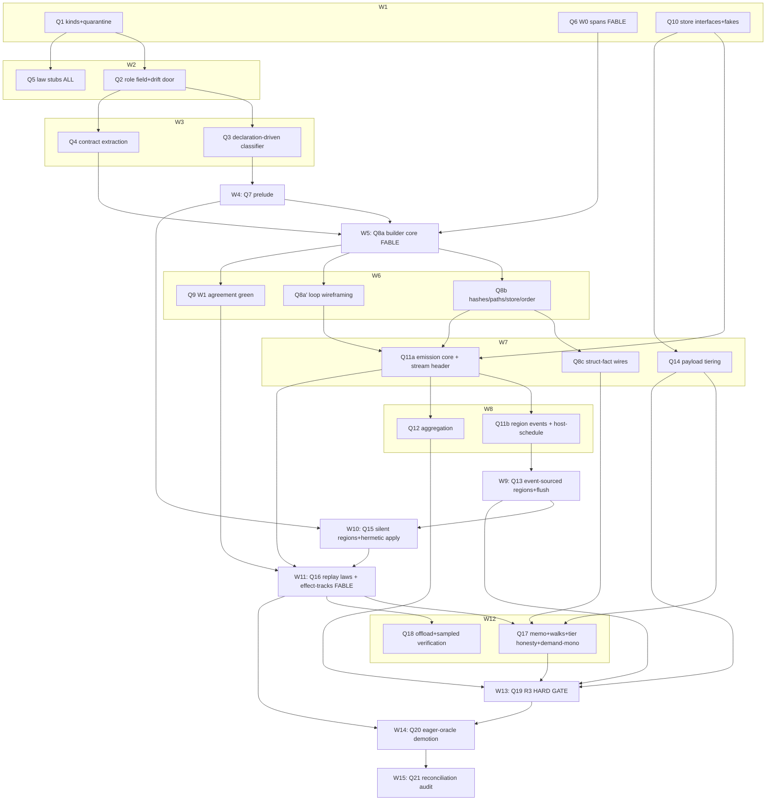

# PROVENANCE.md — implementation plan (linear)

*Step-by-step plan for the stable spec (`PROVENANCE.md`, post rounds 1–3). LINEAR by
design; the parallelized DAG is Part II below. **STATUS: EXECUTED TO COMPLETION —
Q1–Q21 all LANDED on main (2026-07-09/10); per-node commits in the "Q21 audit" section
at the bottom.** Every step landed green under the standing gates (**suite 0 failed ·
conformance 651 · tsc 0**); stubs landed before machinery for every law family.
Supersedes the P-track in `REWORK-DAG.md` Phase 2 — absorption map at the bottom of
Part I.*

**Harness decision (CF-DO cluster, testable without deploying):** the DO surface is
built **interface-first**. Two ports own all platform contact:
`ProvenanceStore` (DO-storage-shaped: get/put/list/txn + an awaited write-barrier
representing output-gate semantics) and `PayloadStore` (R2-shaped: put/get by hash,
async settle). Law and unit tests run against **in-memory fakes implementing the same
interfaces with fault injection** (write failure, forced eviction = drop all in-memory
state and refold, delayed R2 settle) — default CI, no cloud, no browser. A thin
**workerd suite** (via miniflare/workerd — local, cloud-free) validates the real
adapter against the fakes' contract: opt-in for routine runs, **BLOCKING for Q19's
forced-eviction conjunct** (fakes prove the fold logic; only workerd proves real
hibernation/output-gate behavior). Rationale: laws need fault injection fakes make
trivial; the adapter surface is two small interfaces; default CI stays hermetic.

## ALREADY AT HEAD (do not re-plan; the hivemind audit mistook landed work for misses — future Sonnets will too)

| Spec section | Satisfied at HEAD by |
|---|---|
| §2 container structural facts — VALUES-layer `{groupingFact, lengthFact}`, PROXIED/PROVENANCED/MINTED verbs, A13 closure (`length` reads container facts) | c27b2e8b62 (C1/C2/C4): map/sort PROXY, filter PROVENANCES; golden-prov-fan + conservation A13 green |
| §3/§4 region discipline — scope tokens, doors, per-(callable,scope) identity, async pending counters | 9f622345d2 (B3) + b81cc2d88c/823a6fcd3c/c9b07242bc (all four binder kinds on ACallable) |
| §4 eager-stamp machinery (the future TEST-ONLY oracle) | production stamping as it exists today (withInputProvenance/mintVerdict, aa04112e3b) — Q9 flags it, Q20 demotes it |
| §1 homoiconicity substrate | `src/provenance/uneval.ts` (moved from `arrival-provenance` at C0, ea39d3bd4a); write/read round-trip pinned by parser tests (`toString()`/reader symmetry) — the PAYLOAD-level round-trip law (spec §5 D2, persisted value+stamp-ids) landed at Q11a: `store/__tests__/emit.test.ts`'s "emitMint — payload lands before the record, value+stampIds round-trip (§5 D2)" block; env-capability assembler primitives |
| §1 substrate — member access algebra | 8568d4fcd8: `arrival/tagless-final/{get,has,keys}` terms land on ADict/AJSObject/AJSArray + de98c16658 Part 1: membrane accessor faces (readMember/hasMember/memberKeys) DELETED — `@`/`@?`/`@keys` verbs invoke the receiver's own terms directly |
| §1 substrate — toJS protocol | de98c16658 Part 2: `schemeToJs` stops eager-materializing, delegates per-class to `arrival/toJS`; `exec()` can return a region-wrapped callable (ALambda/AProcedure as a host fn, DETACHED_SCOPE precedent); null↔nil round-trip closed |
| §1 substrate — dotted-path/member-walk | 8568d4fcd8 (S6): `member-walk.ts` deleted, `ASymbol.object`'s zero-producer path confirmed dead, dotted identifiers hit the normal unbound-variable door |
| Crossing-seam ingress channel (feeds Q11a's ctx-derived record fields) | ctx tranches dd045a810e/1101971f40/162af3c39c: rosetta-ctx-single-channel COMPLETE — flat `CallCtx`, mandatory `this`, `testCallCtx()` the sanctioned direct-call idiom, zero silent `CONSTANT_CTX` fallbacks |
| §4 hermetic env / heap accounting | a823e402fd (env T0): `Environment.__heapMeter__` deleted, meter owned by `RunContext`; `Environment.set()` narrowed to `EnvironmentValue` only (auto-boxing branches gone) |
| §1 template layer (W0 substrate) | e2052c9480: `EnvLookup` deleted — `TemplateValue = SchemeValue`, single-typed template layer (span propagation threads one value shape, strictly easier) |
| Async/promise plumbing (I4 / effect-track replay substrate) | 19b20b3abb: LIPS promise decomposer replaced by `maybeThen` (single-promise, sync-stays-sync, never traverses) |
| §2 R2 / A13 ledger accuracy | be0b3e4047: stale A13 GAPS ledger row retired — C4's fix (c27b2e8b62) had already closed A13; only the ledger bookkeeping lagged. A13 G2 gate CLOSED |

What §2 R2 still LACKS — and this plan builds — is the WIREFRAME-side struct-fact
wires: see Q8c.

## Cluster V — vocabulary & declarations (spec §2)

**Q1 — lineage kinds + quarantine.** Lands: `sink`/`transparent`/`loop` kinds in
`src/values/lineage.ts`; `loop` lowers to `binder{cycles}`; `opaque` quarantine drift
alarm — MACHINERY only; the baseline NUMBER is a post-Q6 artifact, never pinned here.
Note — two strata of `opaque`, do not conflate: **graph-opaque** is the `LineageNode`
kind (`{ kind: "opaque" }`) already at HEAD (`src/values/lineage.ts`, classifier's
black-box fallback) — nothing to land. **Declaration-opaque** is the future quarantined
`provenance` ROLE (spec §2's declared-role vocabulary, landing at Q2) — the V3 drift
alarm this node pins tracks THAT population, not the graph kind. Depends: —. Gate:
standing + new kind unit rows. Risk: low.

**Q2 — declared `provenance` role field.** Lands: role field on symbol declarations
replacing `fanout?`/`pure?` (two readers each); drift-alarm door (role vs contract
shape, assembly-time). Depends: Q1. Gate: standing + drift-door rows. Risk: low.

**Q3 — declaration-driven classifier.** Lands: classifier consumes declared roles only;
`isRosettaIn` heuristic + `.fanout` duck-reads deleted; named-let/do classify `loop`.
Depends: Q2. Gate: standing + V2/V4 law rows green. Risk: classifier consumers in
`src/provenance/` analysis layer may pin old kinds — sweep them in-step.

**Q4 — contract extraction of callback roles.** Lands: z.lambda position+return →
element/control/effect/accumulator; fold declares its acc chain; extraction-vs-
declaration drift door. Depends: Q2. Gate: standing + role-extraction rows. Risk:
polymorphic-return callbacks (spec LIMIT) — the door must under-trigger, not guess.

## Cluster L — law stubs (spec §7; stubs BEFORE machinery)

**Q5 — all law families land as stubs.** **None of the six stub files below exist yet
at HEAD — creating them IS Q5.** (A prior audit round misread this absence as a defect;
stated plainly so no future reader repeats it.) Six files, `.test.ts` suffix throughout
(vitest convention, per `.claude/rules/tests.md`) — every §7 spec law is assigned to
exactly one:

| Stub file | §7 laws it houses |
|---|---|
| `src/__tests__/laws/provenance-roles.law.test.ts` | V1/V2/V3/V4 role-vocabulary rows (drift-alarm doors, opaque quarantine, loop kind) |
| `src/__tests__/provenance/wireframe-agreement.law.test.ts` | wire-locality (assembly-time FV check) · W1 agreement (m3-scoped: exact on port-coupled+segments, abstract both-arms on pure-mux — carries the m3 note VERBATIM, "do not fix by re-recording") · **I5 exterior collapse** (region = ONE wireframe node; it.todo, flips at Q8a) |
| `src/__tests__/provenance/replay.law.test.ts` | wire-γ · replay-nondeterminism · pure-mux derivation · effect-track replay-between-records (sub-gate) — all flip at Q16 |
| `src/__tests__/provenance/track-cone.law.test.ts` | track containment (stamp arm flips Q9, replay arm flips Q16) · track separation (Q16) · R2 demand-monotonicity (cone(count) ⊆ cone(value), cone(field-k) ⊆ cone(whole); machinery at Q8c, law flips Q17) |
| `src/__tests__/provenance/track-stream.law.test.ts` | W3 port completeness (Q11a) · stream fold + monotonicity + fold-as-recovery (Q13) |
| `src/__tests__/doors/tier-honesty.law.test.ts` | tier honesty (Q17) |

Two rows are LEDGER-ONLY, not stub files — they get an `@ledger` row citing their
flipping step but no law-test body yet: **loop-unroll** (grok finding #19 — widened vs
exact-via-count cones; staged it.todo, ledger-visible through Q21) and **memory
retention** (rides the R3 gate at Q19 — a benchmark assertion, not a law-test row).

All rows land it.todo/it.fails with ledger rows naming their flipping step (Q-numbers).
Generator corpus class list extended per spec §7. Depends: Q1 (naming). Gate: walker
green, zero unexpected. Risk: none — stubs are the spec made executable-red.

## Cluster S — spans

**Q6 — W0 span propagation through syntax-rules.** Lands: hygiene rename carries spans;
every post-expansion Pair has a span; opaque-count alarm baselined AFTER this. Depends:
— (parallel-eligible from day one; sequenced here only because this plan is linear).
Gate: standing + span-totality check on the conformance corpus. Risk: HIGH-subtlety
(hygiene machinery); the one step most likely to surface interpreter bugs.

## Cluster W — prospective layer (spec §1)

**Q7 — program prelude.** Lands: pure-only prelude classification at wireframe build
(same classifier that finds ports — port-reaching defines rejected into wireframe
material); content-addressed prelude artifact; hermetic-env assembler recipe (base
packs + prelude + ingress) as a named EnvCapability composition. Note: the assembler is
a NAMED COMPOSITION of primitives already at HEAD (`assembleEnv`/`EnvCapability`/
`schemePacks` — `src/common/kernel.ts`, `src/common/scheme-env.ts`, the base-packs
assembly used by `initBridge`) — Q7 wires a recipe over them, it does not invent new
env-assembly machinery. Depends: Q3. Gate: standing + prelude-membership rows — BOTH
directions: a fetch-wrapping helper MUST be rejected AND a pure helper MUST be
referenced by name (never carried as payload). Risk: transitive port-reachability
through first-class HOFs — conservative rejection is correct (falls to wireframe
material).

**Q8a — wireframe builder core (Fable).** Lands: classify() generalized whole-program
per the wireframe design §2 AS AMENDED: pure-mux collapse with **selector-cone
REACHABILITY analysis owned HERE** (Q3 supplies declarations only — reachability of a
port from a selector's cone is builder analysis, not classification); `uneval` emitting
closed wire lambdas (FV ⊆ params ∪ prelude-names, wire-locality enforced at emission);
region-as-one-node exterior collapse (I5 row flips). Note: field-step classification is
PARTLY landed already — `src/values/lineage.ts`'s `memberRead` canonicalization and the
`field` `LineageNode` kind exist at HEAD (feeding the tagless `get`/`has`/`keys` trio,
8568d4fcd8/de98c16658), and `walk()`'s `field` arm already does selector-cone-shaped
reachability over existing `field` nodes (descend the focused child, demand-mode
match-or-prune) — Q8a's REACHABILITY work is extending this pattern to port-coupled mux
selectors, not building field-step classification from zero. Depends: Q4, Q6, Q7. Gate:
standing + wire-locality green + I5 row + builder core rows (loop-free + fan scope
acceptable for first landing). Risk: the largest single node.

**Q8a′ — loop/binder-cycle wireframing (HARD gate before emission).** Lands: loop
wireframing (binder{cycles} nodes, backedge wiring) — loop-heavy programs must have
template referents BEFORE records key against them; emission without this would write
records with no template. Depends: Q8a. Gate: standing + loop-wireframe rows. Risk:
widening interplay — cone traversal termination (V4) rows exercise here.

**Q8b — hashes, paths, store, order.** Lands: template-hash + site-hash, ordinal-PATH
keying, root-binder program order, template-store interface (fake-backed). Depends:
Q8a. Gate: two hashes + path keying + template-store rows. Risk: low (mechanical
against spec §5/§1). AMENDED (elk-render research,
docs/working-proposals/inhuman-elk-over-provenance.md): the render join needs the
REVERSE index — records key on template-hash + ordinal-path, the plane keys on
site-hash; Q8b's template-store interface must expose ordinal-path → site-hash
resolution (a derivable index, not new stored state). Cheap here, painful retrofit;
gate gains a reverse-resolution row.

**Q8c — wireframe struct-fact wires (the one true R2 gap; spec §2 R2 + §6 lattice).**
Lands: fact-TAGGED value wires (per spec A5: ONE edge species, a tag not a second
kind) in the builder's output; count-demand cone ROUTING over wireframe + stream
(length queries traverse fact wires, never element wires); the values-layer facts
landed at c27b2e8b62 get their prospective mirror. The R2 demand-monotonicity law's
machinery — the law row itself flips at Q17 (query maturity). Depends: Q8b. Gate:
standing + fact-wire rows (a count-demand cone touches ZERO element wires — asserted).
Risk: low-medium — the routing is new but the demand lattice is specified.

**Q9 — W1 agreement green.** Lands: eager-oracle vs wireframe cone agreement over the
extended generator corpus; eager stamp path becomes flag-gated test mode (oracle
plumbing only — production demotion is Q20). GATE RESTATED per the spec's m3 precision
trade: naive cone-equality FAILS BY DESIGN on pure-mux wires — agreement is SCOPED:
port-coupled decisions + non-mux segments assert exact equality; pure-mux rows assert
the abstract both-arms cone; exact arm equality is asserted only under
pure-mux-derivation at Q16. Depends: Q8a (consumes the builder's graph — NOT Q8b;
hashes/keying are stream-side artifacts agreement never reads). Territory confined to
test files + READING the oracle flag (the op-helpers WRITE belongs to Q20). Risk:
agreement failures are FINDINGS (wrong roles, builder bugs) — budget for a fix loop,
Fable escalation on design-level failures.

## Cluster R — retrospective layer + DO surface (spec §5)

**Q10 — store interfaces + fakes.** Lands: `ProvenanceStore`/`PayloadStore` interfaces,
in-memory fakes with fault injection (write-fail, eviction, delayed settle), the
harness wiring (default CI). No production emission yet. Depends: — (interface work;
sequenced after Q9 in linear order). Gate: standing + fake-contract rows. Risk: low.

**Q11a — record emission core (flag-gated sidecar).** Lands: record kinds per spec
table; deterministic ids (template-hash, ordinal-path, region epoch); per-region seq;
idempotent upsert against the store interface; payload shape = value + stamp ids under
write/read; **the STREAM-level semantics-epoch header (spec C6)** — the record-level
region epoch is NOT the header; Q18 consumes this. Territory: `src/eval/*` emission
hooks + `src/provenance/store/emit*` — NOT region-scope.ts. Depends: Q8b, Q8a′ (loop
records need template referents), Q10. Gate: W3 port-completeness green (incl. retry
idempotence via fault injection); sunset byte-identical (flag-gated). Risk: emission
overhead on hot paths — measure in-step, budget ~µs/record.

**Q11b — region events + host-schedule.** Lands: track open/close events from B3
counters; host-schedule triples for order-dependent selector hosts — the
region-scope.ts half of emission, split out because that file serializes with Q13/Q15.
Depends: Q11a. Gate: region-event rows + schedule rows. Risk: low.

**Q12 — aggregation.** Lands: path-scoped RLE runs per the applicability table (fan
ordinals, ingress bindings, open/close deltas; NEVER mints/schedules/decisions).
Depends: Q11a. Gate: standing + aggregation rows (pure loop = O(1)+count observed).
Risk: low.

**Q13 — event-sourced regions + flush.** Lands: region state reconstruction by folding
the stream (fold-as-recovery green under forced-eviction fault injection); flush at
ports with awaited write barrier (output-gate semantics on the interface), size/time
backstop, pre-hibernation hook on the interface; **the I4 async promise-pending rule's
test home** (region close with unsettled egress throws the incomplete door — asserted
here, where close semantics live). Depends: Q11b. Gate: track-stream.law fully green
INCLUDING the eviction-refold row AND the port-completion barrier assertion
(durable-before-complete; a failed write aborts the request; idempotent retry
re-emits safely). Risk: async settlement ordering — the per-region seq must be
settlement-ordered under injected delays.

**Q14 — payload tiering.** Lands: ring → store → R2-fake → stub state machine with the
NAMED `pending → R2-ref` settlement transition (spec m6); per-tier deterministic
degradation surfaced in the answer envelope (`replayed | replayed-cached | recorded |
stub`); privacy LIMIT flag plumbed (retention metadata on payload records). Note: the
in-memory→degraded-view mechanics wrap the EXISTING `egressContainerProxy`
(`src/values/egress-proxy.ts`, already the lazy-materialization seam for
AVector/APair/ADict's `arrival/toJS`) — tiering adds a tier-state gate in front of that
proxy's reader, it does not replace or duplicate it. Depends:
Q10 ONLY (the state machine + envelope build against fakes with synthetic payloads —
hivemind-verified; full integration against real emission re-verifies at Q19). Gate:
tier state-machine rows + tier-honesty stubs half-green (recorded/stub arms; replayed
arms flip in Q17). Risk: eviction policy tuning is config, not design — keep knobs
explicit.

## Cluster G — γ / replay (spec §4)

**Q15 — silent regions + hermetic apply.** Lands: silent-region mode on B3 (doors
active, emission off). Note: a "silent region" IS an emission-off flag layered onto the
region discipline already landed in `src/values/primitives/region-scope.ts` (B3's scope
tokens `{open, pending, signal}`, doors, per-invocation identity) — Q15 adds the flag
and the emission-suppression path, it does not build region discipline from zero; γ =
apply(wire, ingress) in Q7's hermetic env. The glass
whole-program replay class (spec §4, V ruling — cached membrane behavior +
whole-program re-run) is ALSO a silent region: the penetration stream is authoritative
and re-run emits zero new records, same discipline as a wire-γ drill-in. Depends: Q7,
Q13. Gate: standing + silent-region rows (a replay emits ZERO records — asserted). Risk:
low — machinery exists (B3 + env assembler).

**Q16 — replay laws green (Fable).** Lands: wire-γ (loop-free adjunction), replay-
nondeterminism (frozen payloads authoritative under a mutated world), pure-mux-
derivation (vs eager oracle's recorded arms), **track-containment-replay,
track-separation** — ALL §7 P9-gated rows flip here (track-containment-STAMP flips at
Q9, where the oracle infrastructure lives). PLUS the **effect-track
replay-between-records mode** (spec §4 CHOSEN: pure stretches applied, recorded port
events interleaved verbatim) — implementation + generator rows exercising effect
callbacks, as its own sub-gate; the G cluster is NOT pure-wire-only. Depends: Q9
(oracle), Q11a/Q11b (records), Q15. Gate: all §7 Q16-gated law rows green — wire-γ,
replay-nondeterminism, pure-mux-derivation, track-containment-replay, track-separation
(spanning `provenance/replay.law.test.ts` and `provenance/track-cone.law.test.ts` per
Q5's stub-file mapping table) — + the effect-track sub-gate; conformance 651. Risk: THE
verification step — failures are design-level and re-open spec rows; schedule slack.

**Q17 — memo + walks + tier honesty.** Lands: egress/cone memo (LRU, ephemeral,
replayed-cached labeling) — SCOPE stated in-code per spec m2: egress/cone queries
ONLY, step-walks are NEVER memoized (a walk-misses-memo assertion pins it); lazy
step-walks off the generator interpreter; the full answer envelope; tier-honesty.law
fully green; the **R2 demand-monotonicity law flips here** (query maturity — Q8c built
its machinery). Depends: Q14, Q16, Q8c. Gate: tier-honesty green +
memo-outlives-payload row + demand-monotonicity green. Risk: low. NOTED for the
P11/Q17-adjacent window (elk triage, inhuman-elk-over-provenance.md §4bis): the ONE
promoted render capability — `spanAttribution(wire, ingress)`, a named γ-side query
(static for the TEMPLATED family, γ in general) answering substring-level
consumption. NOT a record kind, NOT a demand-lattice amendment (§6 excludes further
grades "until a consumer demands it" — this is that consumer, demanding at the query
layer). LIMIT: opaque JS rosetta assembly stays unattributable.

**Q18 — offload protocol.** Lands: drill-in request serialization (template-hash,
ingress payloads, stream epoch from Q11a's header); worker-side epoch refusal AND the
**sampled wire-γ verification path on epoch mismatch** (spec C6's second disjunct —
verified against recorded egresses before answers are trusted); the protocol is
interface-level (any executor — same process in tests, stateless Worker in prod).
Depends: Q16. Gate: standing + epoch-mismatch refusal rows + sampled-verification
rows. Risk: low.

## Cluster Z — gates & cutover

**Q19 — the R3 hard gate.** Lands: the Appendix A.2 reference workload as a synthetic
program in `__benchmarks__`; the gate enumerates **A.2's three conjuncts as named
assertions**: (1) completes with full provenance inside 128MB with tiering active,
(2) forced mid-run eviction + fold-reconstruction of regions, (3) every drill-in
answer carries an honest evidence tier — PLUS the **four break-order probes** as named
assertions (DO-write volume, R2 settle latency, ring misconfiguration, drill-in CPU).
Conjuncts 1 and 3 run on fakes; **conjunct 2 runs on workerd as a MERGE BLOCKER**
(fakes prove the fold logic; only workerd proves real hibernation/output-gate
behavior — local, cloud-free). Depends: Q12, Q13, Q14, Q17. Gate: all three conjuncts
+ four probes green. Risk: if headroom < stated, the spec's Appendix A re-opens — this
gate exists to catch exactly that.

**Q20 — eager-oracle demotion.** SPLIT (V ruling 2026-07-09, sampler review):
**Q20a LANDED early** (54e6347418, no Q16/Q19 dependency) — the flag write-side wired
into `withInputProvenance`/`mintVerdict`: OFF skips stamp accumulation (filter +
union allocations) while R1 boxing + ctx propagation stay intact; default UNCHANGED
(true). The opt-OUT for provenance non-consumers (arrival-sampler's ~513
calls/decode-step oracle loop opts out via `setEagerProvenanceOracleEnabled(false)`;
module-global granularity by ruling — upgrade path if ever needed is a
RunContext-carried flag). **Q20b — the demotion proper** lands here as originally
scoped: default flip, stamp accumulation compiled out of production hot paths
(test-flag only, per C12), the W4 accumulation death, sort-comparator host-schedule
wiring (Q11b's documented deriveSortCompare gap). Depends: Q16 (oracle no longer
needed in prod), Q19. Gate: standing + perf delta recorded; oracle mode still runs
the agreement corpus in CI. Risk: flushes out hidden production readers of eager
stamps — sweep before flipping (SWEEP LIST below). SWEEP LIST NAMED
(integration research, docs/working-proposals/): **`@here.build/arrival-reflect`
is the largest hidden production reader** — all six verbs project
`ResultHandle.teleological()`'s EvalTrace (the §1-EXCLUDED representation);
re-grounds on wireframe-cone × stream joins per
arrival-reflect-env-over-provenance.md. Second reader: inhuman studio's ~20
EvalTrace files (elk render pile, inhuman-elk-over-provenance.md). Neither blocks
Q20 core — both are named consumer waves after it.

**Q21 — reconciliation audit.** Lands: REWORK-DAG P-track marked superseded with the
absorption map; spec cross-check (every CHOSEN row → implementing step → law);
POST-MIGRATION rows for any downstream fallout; memory/docs sync; **loop-unroll stays
LEDGER-VISIBLE** (the staged it.todo survives the audit with its gate named — never
silently dropped). Depends: all. Gate: audit checklist recorded in-doc. Risk: none.

## P-track absorption map

| Old P-node | Fate |
|---|---|
| P1–P5 | → Q1–Q5 (unchanged in spirit; law list extended) |
| P6 | → Q6 (unchanged) |
| P7 | → Q7+Q8+Q9 (SPLIT: prelude new; builder amended by pure-mux collapse, closed
lambdas, two hashes, ordinal paths) |
| P8, P8b | → Q10–Q14 (stream reworked: DO interfaces, event-sourcing, tiering are new) |
| P9 | → Q15–Q18 (silent regions, memo, offload, epoch — all new obligations) |
| P10 | → Q19+Q20 (R3 now the A.2 pass condition incl. forced eviction) |
| P11 | unchanged — product track, out of this plan; gates on Q17 for drill-in |

---

# Part II — the execution DAG (max-parallelized)

*The linear steps (with the adjudicated splits: Q8a/Q8a′/Q8b/Q8c, Q11a/Q11b) reworked
into launchable waves. Conventions mirror REWORK-DAG.md's main work: mermaid + node
table + agent tiering + standing gates; shared tree, NO-COMMIT discipline for agents,
main thread (Fable) harvests, verifies gates, and commits between waves with explicit
pathspecs. Parallelization rule: two nodes share a wave iff their FILE TERRITORIES are
disjoint AND neither consumes the other's artifacts.*

**Standing per-wave gates:** suite 0 failed · conformance 651 · tsc 0 · ledger walker
green. Per-node exit gates from Part I carry over unchanged.

## Pre-wave 0 — tree hygiene (BLOCKING) — CLEARED 2026-07-09

In-flight tranches in the same tree occupied territories this DAG needs: rosetta.ts /
membrane.ts / evaluator.ts (Q11a's hooks), capability.ts / common/symbols (V-cluster),
op-helpers.ts (Q9 reads, Q20 writes). RULE (unchanged going forward): any tranche
touching `rosetta.ts`, `membrane.ts`, `evaluator.ts`, `region-scope.ts`, `capability.ts`,
`common/symbols/*`, or `op-helpers.ts` must LAND (or be explicitly frozen with its
owner's sign-off) before a wave launches. Tranches confined elsewhere may continue —
wave 1's territories (lineage.ts, syntax-rules/reader, new store files) are this DAG's
alone.

All five named tranches are LANDED:

| Tranche | Landed at |
|---|---|
| ctx-single-channel | dd045a810e / 1101971f40 / 162af3c39c (tranches 1–3, COMPLETE per 162af3c39c's own commit message) |
| AWrap/AUnwrap rework | 409c467ef8 |
| type()/interop reworks | 3027dc4acb (CLASS is the term) / 9746386f84 (interop-access family rule) |
| member access | 8568d4fcd8 (tagless member access + dotted-path elimination) |
| accessor dissolution | de98c16658 (membrane accessors + schemeToJs move into the algebra) |

**Pre-wave-0 = CLEARED; wave 1 launches without false gates.** Verify with `git status`
against the territory column at launch time regardless — the rule above still applies to
any NEW tranche opened after this clearance.

## The DAG

**Wave count: 15 (+ pre-wave 0). Critical path (15 waves):** Q1 → Q2 → Q3 → Q7 → Q8a →
{Q8b | Q8a′} → Q11a → Q11b → Q13 → Q15 → Q16 → Q17 → Q19 → Q20 → Q21. The Q11 split
added one serialized region-scope wave but bought real width: Q9 moved up to wave 6
(false Q8b dep removed), Q14 up to wave 7 (needs only Q10), Q8c fits wave 7 (wireframe
module frees after Q8b). Q6 must land by wave 5; Q10 by wave 7.

## Node table

| Node | Wave | Agent | Brief cites (spec §) | File territory | Exit gate |
|---|---|---|---|---|---|
| Q1 | 1 | Sonnet | §2 kinds, quarantine | `src/values/lineage.ts` + its tests | kinds exist; V3 alarm machinery (no baseline pin) |
| Q6 | 1 | **Fable** | wireframe design W0; §1 spans | `src/eval/syntax-rules.ts`, `src/reader/*` | span totality on conformance corpus |
| Q10 | 1 | Sonnet | Part-I harness; §5 store semantics | NEW `src/provenance/store/*` | fake-contract rows green |
| Q2 | 2 | Sonnet | §2 role field, drift door | `src/common/symbols/*`, `src/common/capability.ts` | V1 green; booleans gone |
| Q5 | 2 | Sonnet fleet | §7 law table verbatim + I5 + demand-mono rows + m3 scoping note | `src/__tests__/{laws,provenance,doors,membrane,ledger}/*` ONLY | walker green; every stub names its Q-node |
| Q3 | 3 | Sonnet | §2 lowering; V2/V4 | `src/values/lineage.ts`, `src/provenance/*` classifier consumers | V2/V4 rows green; heuristics deleted |
| Q4 | 3 | Sonnet | §2 callback roles | `src/common/symbols/rosetta.ts`, `src/common/scheme-zod.ts` | extraction rows; under-trigger door |
| Q7 | 4 | Sonnet | §1 prelude row (M1) | NEW `src/provenance/wireframe/prelude.ts`; assembler recipe file | reject fetch-wrapper AND pure-helper-by-name rows |
| Q8a | 5 | **Fable** | §1 model + collapse + A2 + I5; uneval closed lambdas; selector-cone reachability | NEW `src/provenance/wireframe/*` core, `src/provenance/uneval.ts` | wire-locality + I5 + core rows (loop-free+fan scope OK) |
| Q8a′ | 6 | Sonnet | §1 loop lowering; V4 | `src/provenance/wireframe/loops.ts` (new sub-file) | loop-wireframe rows; HARD gate before Q11a |
| Q8b | 6 | Sonnet | §5 hashes/paths; §1 D6; C4 | `src/provenance/wireframe/{hash,keying,order,template-store}.ts` (new sub-files) | two hashes; path keying; store rows |
| Q9 | 6 | Sonnet (Fable escalation) | §7 W1 agreement AS SCOPED (m3) | test files ONLY + READ oracle flag | scoped agreement green (exact on port-coupled+segments; both-arms on pure-mux) |
| Q8c | 7 | Sonnet | §2 R2 + §6 lattice + A5 | `src/provenance/wireframe/fact-wires.ts` + cone routing | count-demand cone touches ZERO element wires |
| Q11a | 7 | Sonnet | §5 kinds/ids/order/D2 + C6 stream header | `src/eval/*` hooks + `src/provenance/store/emit*` (NOT region-scope) | W3 green incl. retry idempotence; header row; sunset byte-identical |
| Q14 | 7 | Sonnet | §5 tiering (A1/m6/m8) | NEW `src/provenance/store/tiering.ts`, envelope types | tier state machine + pending→R2-ref rows; recorded/stub arms |
| Q11b | 8 | Sonnet | §5 region events + D5 | `src/values/primitives/region-scope.ts` events | region-event + schedule rows |
| Q12 | 8 | Sonnet | §5 aggregation + m4 | NEW `src/provenance/store/aggregation.ts` | pure loop O(1)+count observed |
| Q13 | 9 | Sonnet | §5 event-sourcing (C1) + flush (C3/m5) + I4 async home | `region-scope.ts` recovery, NEW `store/flush.ts` | fold-as-recovery + eviction-refold + barrier assertion + I4 row |
| Q15 | 10 | Sonnet | §4 silent regions (A4/m1); §1 hermetic env | `region-scope.ts` (post-Q13), NEW `src/provenance/replay.ts` | replay emits ZERO records |
| Q16 | 11 | **Fable** | §4 R1 + ALL §7 Q16-gated rows + effect-track mode | fix-loop across wireframe/emission/replay + law files | 5 law families + effect-track sub-gate green |
| Q17 | 12 | Sonnet | §4 memo (m2); §5 envelope; §6 lattice | NEW `src/provenance/replay-memo.ts`, walk streaming | tier-honesty + memo-outlives-payload + walk-misses-memo + demand-mono green |
| Q18 | 12 | Sonnet | §4 offload + C6 BOTH disjuncts | NEW `src/provenance/offload.ts` | refusal rows + sampled-verification rows |
| Q19 | 13 | Sonnet | Appendix A.2 verbatim | `__benchmarks__/provenance-budget*`, workerd config | 3 conjuncts + 4 probes; conjunct 2 on workerd = MERGE BLOCKER |
| Q20 | 14 | Sonnet | §4 oracle row (C12) | `src/values/op-helpers.ts` + stamp sites (the WRITE territory Q9 only read) | prod path stamp-free; oracle still runs agreement corpus in CI |
| Q21 | 15 | **Fable (main)** | whole spec | docs only | CHOSEN→step→law cross-check; loop-unroll ledger-visible |

Agent totals: **3 Fable briefs** (Q6, Q8a, Q16) + **21 Sonnet briefs** + main-thread
harvest/commit + Q21 audit. Opus: none.

## Sequencing notes

- **Stubs before machinery is wave-structural**: Q5 lands in wave 2, before any
  machinery; later waves flip stubs, never invent law shapes.
- **Q6 off-critical-path but time-critical**: zero dependencies, highest subtlety;
  launch wave 1, must land by wave 5.
- **Wave 6 is the builder fan-out**: Q8b/Q8a′/Q9 all consume Q8a and are pairwise
  disjoint (named wireframe sub-files vs test files). Q8a′ is a HARD gate before
  Q11a — loop records need template referents (adjudication item 10, confirmed: not a
  fallback nicety).
- **Wave 7 pairs Q8c, Q11a, Q14**: wireframe module (freed by Q8b), eval+store-emit,
  and the tiering module — pairwise disjoint. Q14's early placement is safe ONLY
  because its full-integration behavior re-verifies at Q19 (adjudication item 12,
  confirmed with that caveat).
- **region-scope.ts is the one contended file**: Q11b (events) → Q13 (recovery) → Q15
  (silent mode) hold consecutive waves 8–10, never concurrent.
- **Q9's territory is tests + a flag READ** — the op-helpers WRITE is Q20's; this kills
  the wave-6 collision risk.
- **Q19 is terminal verification**; Q20 (demotion) gates on it — the oracle dies only
  after the budget passes with the oracle still available for forensics.

## Risk register (top 3, with fallbacks)

1. **Q6 — spans through hygiene (Fable, wave 1).** FALLBACK if stalled: waves 2–4
   proceed (V/L clusters + Q7 need no spans); Q8a proceeds with span-partial keying on
   a macro-free corpus (scoped W1 gates on that subset; opaque-alarm baseline
   deferred); full-corpus re-gate when Q6 lands. Nothing downstream is redesigned.
2. **Q8a — builder core (Fable, wave 5).** FALLBACK: first landing scopes to loop-free
   + fan (wire-γ adjunction is loop-free-scoped anyway); Q8a′ carries loops in wave 6 —
   already structured as its own node, so the fallback is the plan.
3. **Q16 — replay verification incl. effect-tracks (Fable, wave 11).** FALLBACK:
   failing rows quarantine as it.fails citing the exact spec row; Q17/Q18 launch
   against the passing subset; failures re-enter the challenge-round protocol (rounds
   2–3 precedent) rather than ad-hoc patching.

---

# Q21 audit — reconciliation (executed 2026-07-10, Fable)

*The audit checklist recorded in-doc, per Q21's own exit gate. Method: verify-don't-
trust — every claim below re-checked against HEAD (grep/read/run), not against commit
messages.*

## 0. Node → commit ledger (all LANDED)

| Node | Commit | Node | Commit |
|---|---|---|---|
| Q1 | a99d116a33 | Q11a | 26b13c8cf9 |
| Q2 | c08622aa6b | Q11b | 4bece685d3 |
| Q3 | 36ca838a1e (+3125f90070 consumer tests) | Q12+Q13+Q14 | c5fe415f0a (one wave-commit) |
| Q4 | d011221645 | Q15 | 17328f1730 |
| Q5 | c07cc8e01f | Q16 | 8e61e01f8a (+spec note cbbf6df89f) |
| Q6 | d8a4acf359 | Q17 | efb4171799 |
| Q7 | 5365d633c7 | Q18 | b509706be1 |
| Q8a | b35b17339e | Q19 | e8c5a37ea6 |
| Q8a′+Q8b | 8052856b0d (+amendment 6876e5c756) | Q20a | 54e6347418 (early, ruling c71d7a05f8) |
| Q8c | 1258fed633 | Q20b | 16ff612f1b |
| Q9 | 67039c24e0 (+finding-4 fix ef2748c979) | Q21 | this audit (docs-only) |
| Q10 | effdb00d32 | Env track T0–T3 | a823e402fd, 3cb4f13b4d, 3d5a4e225e, e20e224101 |

## 1. Spec cross-check — every `**CHOSEN` row → implementing commit/module → pinning law

36 normative CHOSEN rows (the §-header legend match excluded). 33 map cleanly; 3
carry findings (F1–F3 below — listed, not fabricated into mappings).

| § | CHOSEN row | Implemented by | Pinned by (file · test) |
|---|---|---|---|
| §1 | two layers (prospective/retrospective) | Q8a `src/provenance/wireframe/builder.ts` + Q11a `src/provenance/store/emit.ts` | `provenance/wireframe-agreement.law.test.ts` · "W1 agreement" block; `provenance/track-stream.law.test.ts` · "W3 port completeness" |
| §1 | designated nodes (ports, port-coupled muxes, fans, binders); A2 pure-mux collapse; D6 root-binder order | Q8a builder classify/walkForCuts; D6: Q8b `wireframe/hash.ts` (nodes array IS root-binder order) | wireframe-agreement · "a pure-selector mux collapses INTO its wire…" + W1 corpus; `src/provenance/__tests__/wireframe-hash.test.ts` |
| §1 | wire = closed arrival lambda | Q8a `src/provenance/uneval.ts` (`unevalWire`) | wireframe-agreement · "wire-locality" block (3 rows, FLIPPED at Q8a; `WireLocalityError` door) |
| §1 | prelude pure-only (A3/M1) | Q7 `src/provenance/prelude.ts` (`classifyProgramPrelude`/`assertPreludeEligible`) + hermetic-env recipe | `laws/provenance-roles.law.test.ts` · "Q7 — PURE-only membership, REJECTED direction"; wireframe-agreement · "Q7 — pure helper stays a REFERENCE" (both gate directions) |
| §1 | frame is abstract interpretation (γ = apply in hermetic env) | Q15 `src/provenance/{gamma,hermetic-env}.ts` + Q16 `replay.ts` | `provenance/silent-region.test.ts` · "B. hermeticApply"; `provenance/replay.law.test.ts` · "wire-γ" block incl. loops-refuse row (adjunction loop-free-scoped, per the EXCLUDED clause) |
| §1 | collapse rule (maximal pure subgraphs → one wire) | Q8a builder | replay.law · "wire-γ subsumes segment losslessness — no interior source/sink/gensym/port-coupled mux inside a wire body" |
| §2 | one declared `provenance` role | Q2 c08622aa6b (`common/symbols/_bake.ts`, `capability.ts`, `errors.ts` drift doors) | provenance-roles · V2 rows (live) + V2-Q4 `ProvenanceRoleShapeError` rows; booleans-gone pinned via `classifierFromEnv.length === 1`. **FINDING F1** (V1 staged rows never flipped) |
| §2 | declaration kinds lower 1:1 | Q1 `src/values/lineage.ts` kinds + Q3 classifier | provenance-roles · V2 "named-let and do classify as loop"; `laws/opaque-quarantine.law.test.ts` · shrink-only alarm (V3) |
| §2 | callback roles from contract | Q4 d011221645 (`_bake.ts` extraction, `symbol.ts` `withCallbackRoles`/`declaresAccChain`) | provenance-roles · "V2-Q4" block (extraction, drift door, acc chain) |
| §2 | container structural facts (R2) | pre-track c27b2e8b62 (C1/C2/C4) + Q8c fact wires | `provenance/conservation.law.test.ts`; `src/provenance/__tests__/wireframe-fact-wires.test.ts`; track-cone · R2 block |
| §3 | track IS a wire | Q16 (track replays as γ over the fan template) | `provenance/track-cone.law.test.ts` · "track containment — REPLAY arm" + "— STAMP arm" |
| §3 | composition operator from host role | Q4 roles + Q16 | track-cone · "track separation" (sanctioned acc chain) + "effect-track empty cone" (terminal) |
| §4 | B3 region discipline = enforcement AND replay container | pre-track B3 (`values/primitives/region-scope.ts`) + Q15 silent mode | `membrane/region.law.test.ts`; silent-region · "doors still fire inside silent regions" |
| §4 | R1 frozen payloads (+gensym mint, +effect replay-between-records) | Q16 `replay.ts` (`FrozenMints`) | replay.law · "replay-nondeterminism" block + "re-execution stability is NEVER claimed" + "effect-track replay-between-records" block |
| §4 | γ runs in a SILENT region (A4/m1) | Q15 17328f1730 | silent-region · "silent region emits ZERO records…" + CONTROL row + leak-proof-nested row |
| §4 | GLASS envs replay by cached membrane behavior | Q15/Q16 | silent-region · "C. glass whole-program replay"; replay.law · "GLASS: whole-program re-run with penetration playback" |
| §4 | γ offloadable (C5) | Q18 `src/provenance/offload.ts` | `provenance/offload.law.test.ts` · "§4 C5 — self-contained request/response wire format" |
| §4 | semantics-epoch pinning (C6) | Q11a `ensureStreamHeader` + Q18 refusal/verification | `store/__tests__/emit.test.ts` · "ensureStreamHeader — §5 C6, write-once"; offload.law · C6 first + second disjunct blocks |
| §4 | identity is TELEOLOGICAL, not logged | doctrine realized by omission: `wireframe/hash.ts` hashes program+site only, no per-pack impl hashing exists (grepped); epoch pins the interpreter | pinned indirectly (replay-nondeterminism + GLASS rows prove behavioral identity). **FINDING F2** — no dedicated law, by the row's own nature |
| §4 | replay memo (m2) | Q17 `src/provenance/replay-memo.ts` | `doors/tier-honesty.law.test.ts` · "replayed-cached never conflated / memo MAY outlive payload"; `provenance/__tests__/replay-memo.test.ts`; walk-misses-memo is ARCHITECTURAL (replay-walk.ts never imports the memo) + asserted |
| §4 | eager stamp path TEST-ONLY oracle (C12) | Q20a+Q20b `src/values/op-helpers.ts` (+numeric.ts direct-union gating) | `laws/oracle-optout.law.test.ts` · "W4 — a real program run with DEFAULT flags accumulates ZERO stamps end-to-end"; wireframe-agreement · "oracle flag — the Q20 read seam" (CI keeps the oracle exercised) |
| §4 | replay cones include port-coupled CONTROL deps | Q16 `replay.ts` `withUnionedProvenance` (spec note cbbf6df89f) | w1-corpus entry `pure-mux-nested-inside-port-coupled-arm`, exercised by the W1 agreement + pure-mux-derivation suites |
| §5 | record kinds + aggregation applicability (A6/m4) | Q11a `store/records.ts`+`emit.ts`; Q12 `store/aggregate.ts` | `provenance/aggregation.law.test.ts` (pure loop O(1)+count, path-scoped runs); emit.test.ts · "every kind … independently idempotent under retry" |
| §5 | host-schedule record shape (D5) | Q11b region-scope events + Q20b `deriveSortCompare` wiring | `provenance/region-events.test.ts` · "host-schedule: accumulate-then-flush-at-close (§5 D5)"; track-cone · "order rides the host-schedule record, never a fabricated inter-track edge" |
| §5 | payload shape (D2: value + stamp ids) | Q11a `emit.ts` | emit.test.ts · "emitMint — payload lands before the record, value+stampIds round-trip (§5 D2)" |
| §5 | deterministic record identity (C2/D1) | Q11a `store/ids.ts` (ordinal PATHS; seq excluded from identity) | emit.test.ts · W3 idempotence block; `store/__tests__/ordinal-path.test.ts` |
| §5 | two named hashes (D3) | Q8b `wireframe/hash.ts` (template-hash spans-stripped, site-hash spans-kept) | wireframe-hash.test.ts; `store/__tests__/template-store.test.ts` · Q8b-amendment reverse-index block (ordinal-path → site-hash, dedup-disambiguation row) |
| §5 | order (D4: emission order, per-region seq) | Q11a seq + Q13 fold | track-stream · "stream fold + monotonicity + fold-as-recovery" (order-insensitive folds over emission orders) |
| §5 | PRODUCTION regions are event-sourced (C1) | Q13 `store/fold.ts` | track-stream · fold-as-recovery rows (forced-eviction fault injection); workerd C2 (real DO abort) |
| §5 | flush policy (C3/m5) | Q13 `store/flush.ts` | `store/__tests__/flush.test.ts`; track-stream barrier assertion; workerd C2 output-gate behavior |
| §5 | payload tiering (A1/m6/m8) | Q14 `store/tiering.ts` + envelope | tier-honesty · m6 pending→R2-ref rows + per-tier monotone degradation; `store/__tests__/tiering.test.ts`, `tiering-egress-gate.test.ts` (wraps `egressContainerProxy`, per plan note) |
| §5 | template store shared/immutable (C4) | Q8b `store/interfaces.ts`+`fakes.ts` (TemplateStore) | template-store.test.ts · put/get round-trip, idempotent upsert, TemplateNotFound door |
| §5 | storage bound as a HARD GATE | Q19 `src/__benchmarks__/provenance-budget*.bench.test.ts` | C1 conjunct (128MB, fakes) + C3 conjunct (honest tiers) + 4 named break-order probes; C2 conjunct on workerd (merge blocker) — all named describe blocks |
| §6 | product trinity (data model only, render DEFERRED P11) | backward/count/field cones `values/lineage.ts` (`fullCone`/`countCone`/`fieldCone`) + Q17 `answerQuery`; plane data model = template graph (Q8a) + ordinal z-space (Q8b) + RLE depth (Q12) | track-cone · R2 rows; replay-walk drained-walk ≡ graph-egress equivalence; aggregation.law z-depth rows. Render itself: DEFERRED by the row's own scope split — no law owed. **FINDING F3** (forward/sealing cone caveat) |
| §6 | demand lattice value/count/field-k | Q8c `wireframe/…` fact-wire routing + Q17 demand walks | track-cone · "R2 demand monotonicity" block incl. "count-demand cone touches zero element wires" (machinery row) |
| §7 | generator corpus classes | Q5+Q9 `src/__tests__/provenance/w1-corpus.ts` (19 class-typed entries: interior-sources, nested-regions, structured-multi-field-egress, macro-expanded, deep-mux-nesting, first-class-hofs) | the corpus IS the pin — consumed by W1 agreement, replay, pure-mux-derivation property rows |

**Findings (CHOSEN rows without a clean 1:1 law, honestly listed):**

- **F1 — V1's five staged rows never flipped.** `laws/provenance-roles.law.test.ts`'s
  V1 block is still five `it.todo`s tagged `@ledger: Q2`, though Q2 landed
  (c08622aa6b) and its exit gate read "V1 green; booleans gone". V1's SUBSTANCE is
  pinned live elsewhere in the same file (V2's arity-1-classifier row retires the
  heuristic seam; V2-Q4's `ProvenanceRoleShapeError` rows pin the drift door), so
  this is bookkeeping debt, not a coverage hole — but the staged bodies (role-field
  completeness grid, booleans-gone-from-declaration-surface, 1:1 lowering as its own
  assertion) were never written. OWNER: first V-cluster touch (or a dedicated
  10-minute flip pass); outside Q21's docs-only territory.
- **F2 — "identity is TELEOLOGICAL" has no dedicated law by design.** The row's
  content is an EXCLUSION (no per-pack impl hashing, no version arbitration) plus a
  doctrine; verified at HEAD by grep (no impl-hash machinery exists) and pinned
  indirectly by replay-nondeterminism + GLASS + epoch rows. Recorded so nobody later
  "fixes" the absence.
- **F3 — forward/sealing cone (trinity surface 2) is retrospective-layer only.**
  `forwardCone` lives in `src/provenance/statechart.ts` (trace-derived analysis),
  not as a wireframe demand walk; no §7 law names it (R5's product query predates
  the spec's law table). Adequate for the data-model scope the row itself claims
  (render DEFERRED P11), but the P11 wave should know the forward cone has no
  wireframe-side twin yet.

## 2. Ledger walk (src/__tests__/ledger/index.law.test.ts)

Walker green. Census after this audit's reconciliation:

- **GAPS — 11 rows, every one names a live owner:** 6 pre-Q-track (gates:
  numeric-json design · R1-adjacent ruling · printer dedup follow-up · R2
  container-provenance ruling · rosetta.ts:70 fix · sunset-suite cleanup pass) + 3
  Q8a documented LIMITs (letrec-closure mux, non-tail begin sink, cond `=>` receiver
  — owner: the post-Q-track builder-fix backlog their gate strings name) + **2 Q9
  findings (5: A21 HOF hole; 6: car/cons sibling leak) — both still `it.fails` in
  `wireframe-agreement.law.test.ts` (verified), gates REWORDED by this audit to name
  the real owner: V ruling pending** (they survived Q8c/Q16/Q17 untouched; the fix
  is a representation ruling, not a mechanical patch).
- **INVERSIONS — 2 rows:** defineRosetta legacy arm (gate: McpEnvCapability
  annotation-lifting) · bare-fn env.set harness wiring (gate: reverse-membrane
  remainder). Both pre-date the Q-track; both gates still live.
- **STAGED — loop-unroll SURVIVES, ledger-visible** (the plan's explicit Q21
  requirement — never silently dropped). Gate re-pointed from "Q21" (now landed, so
  it no longer names an owner) to the first loop-cone consumer wave (walking driver /
  P11 drill-in); both machinery halves exist since Q16, only the widened-vs-exact
  comparison body is unstaged. **memory-retention RETIRED to a comment** — its gate
  (Q19) landed the exact benchmark assertion it was staging (C1 conjunct), same
  discipline as the A13 retirement precedent.

## 3. REWORK-DAG P-track

Verified: `REWORK-DAG.md`'s Phase-2 section carries the SUPERSEDED banner pointing at
this file's absorption map ("do not plan new provenance work against P-nodes") — added
before this audit, confirmed accurate at HEAD; no edit needed. The absorption map in
Part I stands (P1–P11 → Q1–Q21 as tabled; P11 remains the live product track, gating
on Q17's drill-in surface).

## 4. POST-MIGRATION rows

Existing rows re-verified against HEAD: `installHeapMeter` row still live at both
cited call sites (annotated); arrival-mcp `execSerialized` row still accurate;
arrival-chain `classifierFromEnv` row still accurate (5 sites, unchanged). Nothing
stale to strike. **Seven rows ADDED** for the Q-track's named downstream fallout:
arrival-reflect EvalTrace hollowing (largest consumer, named wave) · studio's 13
EvalTrace files (plan's "~20" corrected by grep) · `rosetta.ts` `argProvenance`
dormant reader · `common/symbols/rosetta.ts` pipe-role mint fast-follow ·
mux-decision live emission (walking-driver wave) · dict per-field stamps · D1 FIFO
ingress-keying stand-in.

## 5. Doc sync

- This file's header: EXECUTED status + landed-commit ledger (§0 above) — the wave
  table's statuses are carried there rather than as 24 table-cell edits.
- "ALREADY AT HEAD" table: the one stale cell fixed (§5 D2 round-trip "not yet a
  named law" → landed at Q11a, law named).
- `PROVENANCE.md`'s sequencing pointer: updated to "EXECUTED TO COMPLETION", pointing
  here.
- Stale in-flight language: swept both docs (grep "in flight|not yet|comes next") —
  no other live instances; PROVENANCE.md §0's "any future work adding either
  re-opens…" is doctrine, not staleness.

## 6. Gates (run at audit HEAD, 2026-07-10)

| Gate | Result |
|---|---|
| full suite (`pnpm test`) | pre-audit **3396 / 0 failed**; post-audit **3395 / 0 failed** (−1 = the retired memory-retention STAGED row's own generated test, the A4/B4 retirement precedent) / 160 expected-fail / 294 skipped / 50 todo |
| conformance | **651 passed / 0 failed — EXACT** (chibi-r7rs-v2.spec.ts) |
| tsc build (`tsc -p tsconfig.build.json`) | **0 errors** |
| ledger walker | green — re-run standalone after this audit's ledger edits (15 passed / 1 todo) |
| benchmarks (`pnpm benchmarks`) | **22/22 passed** (3 files — grew past the brief's "20/20": Q19+Q20 added rows; count verified green, not pinned) |
| workerd (`pnpm workerd`, Q19 conjunct C2 merge blocker) | **2/2 passed** (real DO abort + fold reconstruction) |

Q21 exit gate — "audit checklist recorded in-doc" — is this section.
