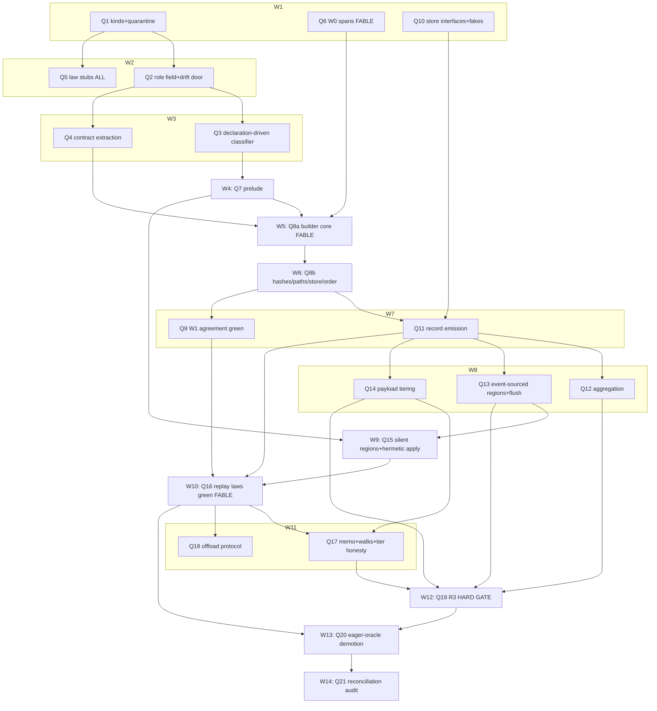

# PROVENANCE.md — implementation plan (linear)

*Step-by-step plan for the stable spec (`PROVENANCE.md`, post rounds 1–3). LINEAR by
design — the parallelized DAG comes next and will live beside this file. Every step
lands green under the standing gates (**suite 0 failed · conformance 651 · tsc 0**);
stubs land before machinery for every law family. Supersedes the P-track in
`REWORK-DAG.md` Phase 2 — absorption map at the bottom.*

**Harness decision (CF-DO cluster, testable without deploying):** the DO surface is
built **interface-first**. Two ports own all platform contact:
`ProvenanceStore` (DO-storage-shaped: get/put/list/txn + an awaited write-barrier
representing output-gate semantics) and `PayloadStore` (R2-shaped: put/get by hash,
async settle). Law and unit tests run against **in-memory fakes implementing the same
interfaces with fault injection** (write failure, forced eviction = drop all in-memory
state and refold, delayed R2 settle) — default CI, no cloud, no browser. A thin
**workerd smoke suite** (via miniflare/workerd, opt-in per tests.md taxonomy — NOT a
default gate) validates the real adapter against the fakes' contract. Rationale: laws
need fault injection fakes make trivial; the adapter surface is two small interfaces;
default CI stays hermetic.

## Cluster V — vocabulary & declarations (spec §2)

**Q1 — lineage kinds + quarantine.** Lands: `sink`/`transparent`/`loop` kinds in
`src/values/lineage.ts`; `loop` lowers to `binder{cycles}`; `opaque` quarantine drift
alarm (shrink-only, baselined post-Q6 per spec). Depends: —. Gate: standing + new kind
unit rows. Risk: low.

**Q2 — declared `provenance` role field.** Lands: role field on symbol declarations
replacing `fanout?`/`pure?` (two readers each); drift-alarm door (role vs contract
shape, assembly-time). Depends: Q1. Gate: standing + drift-door rows. Risk: low.

**Q3 — declaration-driven classifier.** Lands: classifier consumes declared roles only;
`isRosettaIn` heuristic + `.fanout` duck-reads deleted; named-let/do classify `loop`.
Depends: Q2. Gate: standing + V2/V4 law rows green. Risk: classifier consumers in
`src/provenance/` analysis layer may pin old kinds — sweep them in-step.

**Q4 — contract extraction of callback roles.** Lands: z.lambda position+return →
element/control/effect/accumulator; fold declares its acc chain; extraction-vs-
declaration drift door. Depends: Q2. Gate: standing + role-extraction rows. Risk:
polymorphic-return callbacks (spec LIMIT) — the door must under-trigger, not guess.

## Cluster L — law stubs (spec §7; stubs BEFORE machinery)

**Q5 — all law families land as stubs.** Lands: `laws/provenance-roles.law`,
`provenance/wireframe-agreement.law`, `provenance/replay.law` (wire-γ +
replay-nondeterminism + pure-mux-derivation), `provenance/track-cone.law` (stamp/replay
containment SPLIT), `provenance/track-stream.law` (fold + monotonicity + fold-as-
recovery), `doors/tier-honesty.law`, wire-locality assembly checks — all it.todo/
it.fails with ledger rows naming their flipping step (Q-numbers). Generator corpus
class list extended per spec §7. Depends: Q1 (naming). Gate: walker green, zero
unexpected. Risk: none — stubs are the spec made executable-red.

## Cluster S — spans

**Q6 — W0 span propagation through syntax-rules.** Lands: hygiene rename carries spans;
every post-expansion Pair has a span; opaque-count alarm baselined AFTER this. Depends:
— (parallel-eligible from day one; sequenced here only because this plan is linear).
Gate: standing + span-totality check on the conformance corpus. Risk: HIGH-subtlety
(hygiene machinery); the one step most likely to surface interpreter bugs.

## Cluster W — prospective layer (spec §1)

**Q7 — program prelude.** Lands: pure-only prelude classification at wireframe build
(same classifier that finds ports — port-reaching defines rejected into wireframe
material); content-addressed prelude artifact; hermetic-env assembler recipe (base
packs + prelude + ingress) as a named EnvCapability composition. Depends: Q3. Gate:
standing + prelude-membership rows (a fetch-wrapping helper MUST be rejected). Risk:
transitive port-reachability through first-class HOFs — conservative rejection is
correct (falls to wireframe material).

**Q8 — wireframe builder.** Lands: classify() generalized whole-program per the
wireframe design §2 AS AMENDED: pure-mux collapse (port-coupled muxes only as nodes),
`uneval` emitting closed wire lambdas (FV ⊆ params ∪ prelude-names, wire-locality
enforced at emission), template-hash + site-hash, ordinal-PATH keying, root-binder
program order, template-store interface (fake-backed). Depends: Q4, Q6, Q7. Gate:
standing + wire-locality green + builder unit rows. Risk: the largest single step;
port-coupled-mux detection needs the selector-cone reachability from Q3's classifier.

**Q9 — W1 agreement green.** Lands: eager-oracle vs wireframe cone agreement over the
extended generator corpus; eager stamp path becomes flag-gated test mode (oracle
plumbing only — production demotion is Q20). Depends: Q8. Gate: wireframe-agreement.law
green; conformance 651 untouched. Risk: agreement failures here are FINDINGS (wrong
roles, builder bugs) — budget for a fix loop.

## Cluster R — retrospective layer + DO surface (spec §5)

**Q10 — store interfaces + fakes.** Lands: `ProvenanceStore`/`PayloadStore` interfaces,
in-memory fakes with fault injection (write-fail, eviction, delayed settle), the
harness wiring (default CI). No production emission yet. Depends: — (interface work;
sequenced after Q9 in linear order). Gate: standing + fake-contract rows. Risk: low.

**Q11 — record emission (flag-gated sidecar).** Lands: record kinds per spec table;
deterministic ids (template-hash, ordinal-path, region epoch); per-region seq;
idempotent upsert against the store interface; track open/close events from B3
counters; host-schedule triples for order-dependent selector hosts; payload shape =
value + stamp ids under write/read. Depends: Q8, Q10. Gate: W3 port-completeness green
(incl. retry idempotence via fault injection); sunset byte-identical (sidecar is
flag-gated). Risk: emission overhead on hot paths — measure in-step, budget ~µs/record.

**Q12 — aggregation.** Lands: path-scoped RLE runs per the applicability table (fan
ordinals, ingress bindings, open/close deltas; NEVER mints/schedules/decisions).
Depends: Q11. Gate: standing + aggregation rows (pure loop = O(1)+count observed).
Risk: low.

**Q13 — event-sourced regions + flush.** Lands: region state reconstruction by folding
the stream (fold-as-recovery green under forced-eviction fault injection); flush at
ports with awaited write barrier (output-gate semantics on the interface), size/time
backstop, pre-hibernation hook on the interface. Depends: Q11. Gate: track-stream.law
fully green INCLUDING the eviction-refold row. Risk: async settlement ordering — the
per-region seq must be settlement-ordered under injected delays.

**Q14 — payload tiering.** Lands: ring → store → R2-fake → stub state machine with
`pending → R2-ref` settlement; per-tier deterministic degradation surfaced in the
answer envelope (`replayed | replayed-cached | recorded | stub`); privacy LIMIT flag
plumbed (retention metadata on payload records). Depends: Q11. Gate: tier state-machine
rows + tier-honesty stubs half-green (recorded/stub arms; replayed arms flip in Q17).
Risk: eviction policy tuning is config, not design — keep knobs explicit.

## Cluster G — γ / replay (spec §4)

**Q15 — silent regions + hermetic apply.** Lands: silent-region mode on B3 (doors
active, emission off); γ = apply(wire, ingress) in Q7's hermetic env. Depends: Q7, Q13.
Gate: standing + silent-region rows (a replay emits ZERO records — asserted). Risk:
low — machinery exists (B3 + env assembler).

**Q16 — replay laws green.** Lands: wire-γ (loop-free adjunction), replay-
nondeterminism (frozen payloads authoritative under a mutated world), pure-mux-
derivation (vs eager oracle's recorded arms) — the three P9-gated law families flip.
Depends: Q9 (oracle), Q11 (records), Q15. Gate: all three green; conformance 651.
Risk: THE verification step — failures here are design-level and re-open spec rows;
schedule slack.

**Q17 — memo + walks + tier honesty.** Lands: egress/cone memo (LRU, ephemeral,
replayed-cached labeling); lazy step-walks off the generator interpreter; the full
answer envelope; tier-honesty.law fully green. Depends: Q14, Q16. Gate: tier-honesty
green + memo-outlives-payload row. Risk: low.

**Q18 — offload protocol.** Lands: drill-in request serialization (template-hash,
ingress payloads, stream epoch); worker-side epoch refusal; the protocol is
interface-level (any executor — same process in tests, stateless Worker in prod).
Depends: Q16. Gate: standing + epoch-mismatch refusal rows. Risk: low.

## Cluster Z — gates & cutover

**Q19 — the R3 hard gate.** Lands: the Appendix A.2 reference workload as a synthetic
program in `__benchmarks__`; measures in-memory headroom, storage volume, break-order
probes; forced mid-run eviction + fold-reconstruction + honest-tier drill-ins as the
pass condition; opt-in workerd smoke suite validating the real DO adapter against the
fake contract. Depends: Q12, Q13, Q14, Q17. Gate: **A.2 pass condition met on fakes**;
workerd smoke green when run. Risk: if headroom < stated, the spec's Appendix A
re-opens — this gate exists to catch exactly that.

**Q20 — eager-oracle demotion.** Lands: eager stamp accumulation compiled out of
production hot paths (test-flag only, per C12); the W4 accumulation death. Depends:
Q16 (oracle no longer needed in prod), Q19. Gate: standing + perf delta recorded;
oracle mode still runs the agreement corpus in CI. Risk: flushes out hidden
production readers of eager stamps — sweep before flipping.

**Q21 — reconciliation audit.** Lands: REWORK-DAG P-track marked superseded with the
absorption map; spec cross-check (every CHOSEN row → implementing step → law);
POST-MIGRATION rows for any downstream fallout; memory/docs sync. Depends: all. Gate:
audit checklist recorded in-doc. Risk: none.

## P-track absorption map

| Old P-node | Fate |
|---|---|
| P1–P5 | → Q1–Q5 (unchanged in spirit; law list extended) |
| P6 | → Q6 (unchanged) |
| P7 | → Q7+Q8+Q9 (SPLIT: prelude new; builder amended by pure-mux collapse, closed
lambdas, two hashes, ordinal paths) |
| P8, P8b | → Q10–Q14 (stream reworked: DO interfaces, event-sourcing, tiering are new) |
| P9 | → Q15–Q18 (silent regions, memo, offload, epoch — all new obligations) |
| P10 | → Q19+Q20 (R3 now the A.2 pass condition incl. forced eviction) |
| P11 | unchanged — product track, out of this plan; gates on Q17 for drill-in |

---

# Part II — the execution DAG (max-parallelized)

*The 21 linear steps reworked into launchable waves. Conventions mirror REWORK-DAG.md's
main work: mermaid + node table + agent tiering + standing gates; shared tree,
NO-COMMIT discipline for agents, main thread (Fable) harvests, verifies gates, and
commits between waves with explicit pathspecs. Parallelization rule: two nodes share a
wave iff their FILE TERRITORIES are disjoint AND neither consumes the other's
artifacts.*

**Standing per-wave gates:** suite 0 failed · conformance 651 · tsc 0 · ledger walker
green. Per-node exit gates from Part I carry over unchanged.

## Pre-wave 0 — tree hygiene (BLOCKING)

In-flight tranches in the same tree — **ctx-single-channel**, the **AWrap/AUnwrap
rework**, and the **type()/interop reworks** — occupy territories this DAG needs:
rosetta.ts / membrane.ts / evaluator.ts (G-cluster, Q11's hooks), capability.ts /
common/symbols (V-cluster), op-helpers.ts (Q9/Q20). RULE: any tranche touching
`rosetta.ts`, `membrane.ts`, `evaluator.ts`, `region-scope.ts`, `capability.ts`,
`common/symbols/*`, or `op-helpers.ts` must LAND (or be explicitly frozen with its
owner's sign-off) before wave 1 launches. Tranches confined elsewhere may continue —
wave 1's territories (lineage.ts, syntax-rules/reader, new store files) are theirs
alone. Verify with `git status` against the territory column below at launch time.

## The DAG

**Critical path (14 waves):** Q1 → Q2 → Q3 → Q7 → Q8a → Q8b → Q11 → Q13 → Q15 → Q16 →
Q17 → Q19 → Q20 → Q21. Q6 and Q10 are off-path in wave 1 (Q6 must land by wave 5;
Q10 by wave 7).

## Node table

| Node | Wave | Agent | Brief cites (spec §) | File territory | Exit gate |
|---|---|---|---|---|---|
| Q1 | 1 | Sonnet | §2 kinds, quarantine | `src/values/lineage.ts` + its tests | kinds exist; V3 alarm pinned |
| Q6 | 1 | **Fable** | wireframe design W0; §1 spans | `src/eval/syntax-rules.ts`, `src/reader/*` | span totality on conformance corpus |
| Q10 | 1 | Sonnet | Part-I harness decision; §5 store semantics | NEW `src/provenance/store/*` | fake-contract rows green |
| Q2 | 2 | Sonnet | §2 role field, drift door | `src/common/symbols/*`, `src/common/capability.ts` | V1 green; booleans gone |
| Q5 | 2 | Sonnet fleet | §7 law table verbatim | `src/__tests__/{laws,provenance,doors,membrane,ledger}/*` ONLY | walker green; every stub names its Q-node |
| Q3 | 3 | Sonnet | §2 lowering; V2/V4 | `src/values/lineage.ts`, `src/provenance/*` classifier consumers | V2/V4 rows green; heuristics deleted |
| Q4 | 3 | Sonnet | §2 callback roles | `src/common/symbols/rosetta.ts`, `src/common/scheme-zod.ts` | extraction rows; under-trigger door |
| Q7 | 4 | Sonnet | §1 prelude row (M1) | NEW `src/provenance/wireframe/prelude.ts`; assembler recipe (new capability composition file) | fetch-wrapping helper REJECTED row |
| Q8a | 5 | **Fable** | §1 model + collapse + A2; uneval closed lambdas | NEW `src/provenance/wireframe/*`, `src/provenance/uneval.ts` | wire-locality at emission; builder core rows |
| Q8b | 6 | Sonnet | §5 hashes/ordinal-paths; §1 D6; C4 store | same wireframe module (sequential after Q8a) | two hashes; path keying; template-store rows |
| Q9 | 7 | Sonnet (Fable escalation on design failures) | §7 W1 agreement | `src/__tests__/provenance/wireframe-agreement*`, oracle flag in `src/values/op-helpers.ts` | agreement green on extended corpus |
| Q11 | 7 | Sonnet | §5 kinds table, ids, order, D2/D5 | `src/eval/*` emission hooks, `src/values/primitives/region-scope.ts` events, `src/provenance/store/emit*` | W3 green incl. retry idempotence; sunset byte-identical (flag-gated) |
| Q12 | 8 | Sonnet | §5 aggregation + m4 | NEW `src/provenance/store/aggregation.ts` | pure loop O(1)+count observed |
| Q13 | 8 | Sonnet | §5 event-sourcing (C1) + flush (C3/m5) | `region-scope.ts` recovery, NEW `store/flush.ts` | fold-as-recovery green under forced eviction |
| Q14 | 8 | Sonnet | §5 tiering (A1/m6/m8) | NEW `src/provenance/store/tiering.ts`, envelope types | tier state machine rows; recorded/stub arms |
| Q15 | 9 | Sonnet | §4 silent regions (A4/m1); §1 hermetic env | `region-scope.ts` (post-Q13), γ entry in `src/provenance/replay.ts` (new) | replay emits ZERO records — asserted |
| Q16 | 10 | **Fable** | §4 R1 + §7 three replay laws | fix-loop across wireframe/emission/replay + the law files | wire-γ, replay-nondeterminism, pure-mux-derivation ALL green |
| Q17 | 11 | Sonnet | §4 memo (m2); §5 envelope enum | NEW `src/provenance/replay-memo.ts`, walk streaming | tier-honesty green; memo-outlives-payload row |
| Q18 | 11 | Sonnet | §4 offload + epoch (C5/C6) | NEW `src/provenance/offload.ts` | epoch-mismatch refusal rows |
| Q19 | 12 | Sonnet | Appendix A.2 verbatim | `__benchmarks__/provenance-budget*`, opt-in workerd config | **A.2 pass condition on fakes**; workerd smoke |
| Q20 | 13 | Sonnet | §4 oracle row (C12) | `src/values/op-helpers.ts` + stamp sites (flag-gating) | prod path stamp-free; agreement corpus still runs oracle in CI |
| Q21 | 14 | **Fable (main)** | whole spec | docs only | CHOSEN-row → step → law cross-check recorded |

Agent totals: **3 Fable briefs** (Q6, Q8a, Q16) + **18 Sonnet briefs** + main-thread
harvest/commit + Q21 audit. Opus: none (no research hole surfaced; the lineage doc is
done).

## Sequencing notes

- **Stubs before machinery is wave-structural**: Q5 (ALL law stubs) lands in wave 2 —
  before any prospective/retrospective machinery exists. Every later wave flips stubs,
  never writes new law shapes (additions go through the ledger convention).
- **Q6 is off-critical-path but time-critical**: it has zero dependencies and the
  highest subtlety — launch it in wave 1 and let it run long; it must land before
  wave 5 (Q8a keys wires by span).
- **Wave 7 pairs Q9 and Q11 deliberately**: agreement failures (Q9) are findings
  against the builder while emission (Q11) proceeds — territories disjoint, and Q16
  needs both.
- **Wave 8 is the widest** (three disjoint new store modules) — the payoff of the
  interface-first harness: all three test against fakes, no shared state.
- **region-scope.ts is the one contended file**: Q11 (events) → Q13 (recovery) → Q15
  (silent mode) touch it in consecutive waves, never concurrently.
- **The R3 gate (Q19) is the DAG's terminal verification**; Q20 (demotion) is gated on
  it deliberately — the oracle dies only after the budget passes with the oracle still
  available for forensics.

## Risk register (top 3, with fallbacks)

1. **Q6 — spans through hygiene (Fable, wave 1).** Highest subtlety; may surface
   interpreter bugs. FALLBACK if stalled: waves 2–4 proceed regardless (V/L clusters +
   Q7 don't need spans); Q8a proceeds with span-partial keying on a macro-free corpus
   (W1 agreement gates on the macro-free subset, opaque-alarm baseline deferred);
   full-corpus W1 re-gates when Q6 lands. Nothing downstream is redesigned.
2. **Q8a — wireframe builder core (Fable, wave 5).** Largest single node. FALLBACK:
   scope the first landing to loop-free + fan subset (the spec's wire-γ adjunction is
   loop-free-scoped anyway); loop/binder-cycle wireframing follows as a Q8a′ node in
   wave 6 beside Q8b (disjoint sub-modules).
3. **Q16 — replay verification (Fable, wave 10).** Failures here are design-level and
   re-open spec rows. FALLBACK: quarantine failing rows as it.fails citing the exact
   spec row; Q17/Q18 launch against the passing subset; a failing row re-enters the
   challenge-round protocol (rounds 2–3 precedent in the challenges doc) rather than
   being patched ad hoc.
