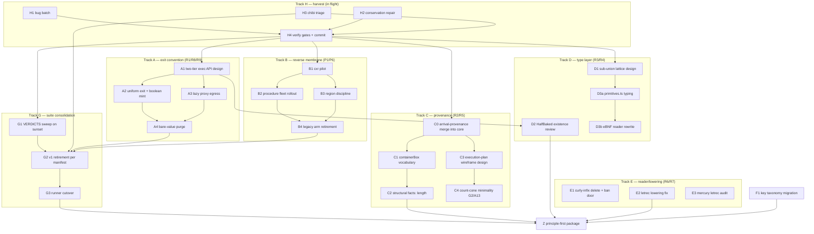

# Rework DAG — the road to a principle-first arrival package

*Companion to [`PRINCIPLES.md`](PRINCIPLES.md) (the constitution) and
[`test-suite-v2/RULINGS.md`](test-suite-v2/RULINGS.md) (the decisions). This file is the
execution plan: every node names its dependencies, its exit gate, and the agent tier that
runs it. Update node status in place as work lands.*

**Definition of done (the endgame gate, node Z):** the package is principle-first when
sunrise IS the default `test` gate, the ledger walker is green, every remaining `[INVERTS:]`
tag cites a live migration (none orphaned), chibi v2 ≥ v1 registry parity, both membrane
doors strict, exit convention uniform (R1), reverse membrane live with region discipline
(P6), and knip production-reachability clean.

## Agent tiering (the assignment rule)

- **Fable** — design, architecture, subtle semantics: anything where the *shape* of the
  answer is undecided (proxy aliasing, provenance cones, type lattices, first-of-kind
  pilots). Fable designs, then hands Sonnet a brief.
- **Sonnet** — all code execution against a written brief/design: fleets, sweeps,
  mechanical migrations, well-specified features. No-commit discipline; main thread
  verifies gates and commits.
- **Opus** — research/archaeology ONLY (read-only investigations, external surveys).
  Never writes code (observed `as any`/`as unknown` habit — exactly what P4/P5 forbid).

Standing gates for every commit: sunrise no unexpected reds · ledger walker green ·
sunset ≤ baseline · `tsc` non-test 0.

## The DAG

Critical path: **H4 → A1 → A2/A3 → A4 → G2 → G3 → Z**. Tracks B/C/D/E/F run parallel to A
once H4 lands; G2 is the convergence point (retirement can't happen while its survivor
rows cite unflipped `[INVERTS:]` tags).

## Node table

| # | Task | Agent | Depends | Exit gate |
|---|---|---|---|---|
| **H1** | Bug batch: `isSchemeValue`→`instanceof AValue`, append P5 door, parseNameDoc colon, canonicalize collisions | Sonnet *(running)* | — | ~12 it.fails flip; GAPS rows pruned |
| **H2** | Conservation repair: append/cdr container-stamp union (naive R2), DR4 box-preserving vector-map, coercion-soundness goldens | Sonnet *(running)* | — | conservation + term-carrier flips; A13 stays it.fails |
| **H3** | Chibi triage: 72× `#:let*` hygiene root cause (minimal repro REQUIRED), registry rows for remaining reds | Sonnet *(running)* | — | repro exists; cutover-gate status report |
| **H4** | Harvest: verify standing gates, commit per-agent as coherent units, explicit pathspecs | **Fable (main)** | H1–H3 | 3 commits on main, gates green |
| **A1** | Two-tier exec API design: simple ("run, get JS") wraps complex ("run, get boxed state + scope + trace"); where the tiers live, what dies (op-helpers shortcut) | **Fable** | H4 | design doc in `docs/working-proposals/`; brief for A2/A3 |
| **A2** | Uniform plain-JS exit implementation + R8 conditional boolean mint (flyweight for provenance-free, fresh ABool for stamped) | Sonnet | A1 | crossings.ts exitForm cells flip green; op-helpers shortcut deleted |
| **A3** | R9 lazy ref-tracking proxy egress: WeakMap singleton tracker, on-demand deep materialization, cycle-safe | **Fable** (proxy core) + Sonnet (test tables) | A1 | container exit rows green; aliasing law rows (shared child = same proxy) |
| **A4** | ~~Bare-value purge~~ **DONE 2026-07-09**: `withInputProvenance` (op-helpers.ts) always boxes now (deleted the empty-provenance raw-scalar tolerance); two siblings of the `number->string` bug found+fixed (`ANil`'s `arrival/tagless-final/length` returned bare `0`; `Environment.set` stored raw boolean/string/symbol unboxed — both now box). All 5 `[INVERTS: bare-value-purge/P4]` tags flipped (tagless-final-equals LANDMINE, equality-representation string+boolean rows, lists-contract-precision's 2 rows) and the ledger INVERSIONS row retired. Mechanism verdict on `equal?`'s representation-blind Setoid: NOT a strict-door throw — the membrane now prevents any internal producer from reaching it with a raw operand, but AString/ABool's tolerance is independently pinned as durable by scheme-string-algebra.test.ts + boolean-landmine-regression.test.ts (both "Clean"-verified); a throw would contradict those siblings, the aspirational-door case P4 warns against. Full raw-scalar production sweep (env/srfi/*, env/r7rs/*, values/primitives/*) found no further sites. Gates: sunrise 1028/149 xfail (net -1, the retired ledger row's own generated test), conformance 651 exact, tsc build 0, sunset 35 failed vs 38 pre-edit (net -3: 1 genuine fix + 2 pre-existing timing-flake tests that happened to pass, confirmed non-deterministic on rerun) | Sonnet | A2, A3 | zero bare-value-purge tags remain in ledger index |
| **B1** | Reverse-membrane cxr pilot: cxr family → ANativeProcedure via applyCallback door, per `docs/working-proposals/reverse-membrane-for-callables.md` + §7 | **Fable** | H4 | pilot green; pattern write-up appended to proposal |
| **B2** | ~~Per-pack fleet rollout~~ REFRAMED by tranche-1 discovery (2026-07-09): packs are already clean (`symbol.native` ops bind ANativeProcedure at assembly; guards widened; zero apologies/bypasses). Real work = **the binder big cut**: capability.ts's `sequence`/`tagless`/`tagless-guard`/`rosetta` cases bind raw gatedRun closures — convert to ACallable family (rosetta → ARosettaProcedure, membrane-crossing). One file, wide blast radius. Plus curry → prelude dissolution (proposal §2, separate step — landed as B5, not this node) | **Fable** (binder cut) + Sonnet (curry prelude step) | B1, A3 landed | live-probe: `map`/`filter`/`pair?` bind as ACallable; HOF matrix green; RosettaSpec arm intact |
| **B3** | Region discipline: scope tokens, pending counters, escape-throws (callbacks region-bound to invocation) | Sonnet (design exists, §7) | B1 | `membrane/region.law.test.ts` it.fails flip; `[INVERTS: region-discipline/P6]` tags die |
| **B4** | ~~Legacy arm retirement~~ **AUDITED 2026-07-09 — arm does NOT die, quarantined by design.** The legacy `SymbolDeclaration` arm (capability.ts:62-78 doc, code ~369-380: bare `Fn` ∪ `RosettaSpec`-shaped-with-`fn`) is confirmed load-bearing, not dead code: `McpEnvCapability` (arrival-mcp) still authors every verb this way (its whole inline-annotation-lifting design assumes bare-fn/object-with-`fn` defs), and every real downstream consumer constructs `SymbolDeclaration`s the same way — confirmed live in `inhuman/sift-submission/mcp/src/packs/*.ts`, `here.build/saas/server/{mcp,arrival}`, `inhuman/saas/mcp`. The ledger (`ledger/index.law.test.ts`) already carried the precise gate pre-audit: `"defineRosetta legacy arm authoring form"` → gate `McpEnvCapability annotation-lifting` (a SEPARATE, undone migration — not B2/B3). Two more still-live bare-fn producers found, neither touched by B1-B3: named-let's `loopFn` (evaluator.ts:1860, proposal §3 "Step 1" — not landed) and `curry`'s returned partial-application closure (env/srfi/srfi-235.ts, proposal §3 "Step 2" — not landed, despite B2's row above listing it as in-scope). **Work done:** retagged 4 test files' stale `[INVERTS: reverse-membrane/P1]` comments (evaluator.spec.ts ×2, membrane-symmetry.test.ts, rosetta-environment.test.ts ×2, scheme-zod.ts's `z.lambda`) to name the real, still-open gates instead of implying B1-B3 closes them; added a clarifying note to capability.test.ts's legacy fixture (confirmed intentional, not debt); converted 2 of several `env.set(bareFn)` test-harness bypasses (input-rest-runtime.test.ts, kwargs-runtime.test.ts) to real `EnvCapability`-wired fixtures per the ledger's own "replacedBy" row (others — vector-map-promise-leak.test.ts, generator-exec.spec.ts, laws/_tables/fixtures.ts — left as a follow-up, out of this audit's named scope); retired the now-resolved `"z.procedure region-free callbacks"` ledger row (region-discipline/B3 landed, membrane/region.law.test.ts's matching row is green). LAMBDA brand (`Symbol.for("arrival/lambda")`) verdict: SURVIVES — named-let is its sole live producer; noted as a module-local-symbol taxonomy migration candidate (P7 corollary), not migrated. Gates: tsc build 0; sunrise 1034/149 xfail (baseline 1035/149, net -1 = the retired ledger row's own generated test, same shape as A4's precedent); conformance (chibi) 570 passed/0 failed in this sandbox (r7rs-tests.scm submodule not initialized here — the "651" baseline figure needs that submodule; 0-unexpected-reds invariant holds regardless); sunset 35 failed/2563 passed, byte-identical failing-test set to baseline, none in a file this audit touched. **Not closed**: true "legacy arm deleted; zero reverse-membrane tags" needs the McpEnvCapability annotation-lifting migration AND proposal §3 Steps 1 (named-let) + 2 (curry) landed first — none of which are B4's to do alone. | Sonnet | B2, B3 | ~~legacy arm deleted; zero reverse-membrane tags~~ REVISED: arm confirmed permanently quarantined pending 3 separate undone migrations (named below); stale tags retagged to name them; ledger accuracy restored |
| **B5** | ~~Steps 1-2: named-let → ALambda, curry → prelude~~ **DONE 2026-07-09** (proposal §12): named-let's `loopFn` mints a real `ALambda` (same `runner`-injection shape `evalLambda` uses; letrec tie via `scope: letResolver`) — the LAMBDA brand's last live producer, so the brand is **DELETED** (not just quarantined): `well-known-symbols.ts`, `membrane.ts`'s `isSchemeValue` arm, `rosetta.ts`'s `jsToScheme` fast-path, `print.ts`'s `functionRepr` guard all lose their LAMBDA-specific code. Consequent dead-code retirement: `wrapLambda`/`wrapLambdaArgs`'s bare-fn arm, `applyArrowProc`'s legacy lambda arm, the module-level `_canBounce` holder (folded into a per-call local — every lambda now receives `canBounce` as an explicit apply-term argument). All three `ACallable` concretes gained `arrival/print` (`#<procedure:name>`) as part of Step 1, per §5 item 7 — otherwise named-let's print form would have silently regressed. Curry (`env/srfi/srfi-235.ts`) dissolved from a native JS partial-application closure into a pure recursive scheme combinator + one native, `procedure-min-arity` (arity introspection off `ACallable.arity`/`.length`, boxed as `AExact`). `env.defineRosetta`'s legacy authoring arm is now the ONLY live bare-fn producer package-wide (unchanged from B4, gated on McpEnvCapability annotation-lifting). Gates: tsc build 0; sunrise 1060/0/150xfail/11todo (0 unexpected — numeric drift from concurrent unrelated work in the same tree); conformance 651/0 exact; sunset 35 failed/1955 passed, same 35 titles as B4's baseline, none in a file this change touched (total pass count dropped from a concurrent v1 test-suite-retirement pass deleting sunset files, orthogonal to this change) | Sonnet | B2, B4 | ~~LAMBDA brand deleted; curry native retired~~ both done; McpEnvCapability annotation-lifting is the one remaining prerequisite for B4's literal exit gate |
| **C0** | Merge `arrival-provenance` into core as `src/provenance/` (spine already in; remaining = analysis layer: flow-graph, lineage, statechart, slice, uneval, regions + its `__tests__`). `git mv` to preserve history; package becomes a pure re-export shim (or dies if downstream can absorb the import change). Goal: types wiring + tests visible IN core so bad provenance decisions surface instantly, not downstream | Sonnet (mechanical move) + **Fable** eyeball on seam (mobx/Observable split stays behind seams) | H4 | core `tsc` 0; provenance tests run under sunrise runners; shim re-exports only |
| **C1** | terms.ts containerBox vocabulary: R2 grouping-fact + named structural-fact fields, EXPLICIT naive strategy | Sonnet | C0 (H2's naive union) | law table names every container's facts; no emergent fields |
| **C2** | Structural facts: length PROXIED through map/sort, PROVENANCED in filter; keyset postponed | Sonnet | C1 | R2 law rows green across carriers (P8: one answer) |
| **C3** | Execution-plan wireframe design: AST → base wireframe, static wires collapse to single provenance edges, runtime wiring into abstract flow; CF-worker memory budget | **Fable** (major design) | — (parallel) | design doc; supersession plan for per-op accumulation |
| **C4** | Count-cone minimality: A13 interim fix DECIDED (C3 design) — one op-layer routing change, `length` reads the container's own flat stamp; rides with C2, subsumed by the wireframe later | Sonnet (with C2) | C2 | golden-prov-fan A13 it.fails flips; G2 gate closes |
| **D1** | Sub-union lattice (R3): stratify SchemeValue into lifecycle sub-unions (EOF ∉ pair, Values/Keyword admissibility); design BEFORE mechanical guard fixes | **Fable** | H4 | lattice doc + type-level encoding proposal |
| **D2** | HalfBaked existence review (R4): earn-its-keep verdict; if stays, toJS → MaybePromise; `{__halfBaked__}` marker dies either way | **Fable** (review) → Sonnet (execute) | A1 (exec-tier interplay) | verdict recorded in RULINGS addendum; marker gone |
| **D3a** | primitives.ts phase-1: honest typing of the regex parse layer | Sonnet | D1 | tsc 0, no `as any` |
| **D3b** | primitives.ts phase-2: eBNF/grammar-driven reader replacing regex piles | **Fable** design → Sonnet build | D3a | chibi parity holds through swap |
| **E1** | Curly-infix elimination (R6): reader mode deleted, `{a * b}` explicit ban door (educational, points at dict grammar + sugarcoat), suite shrinks to ban+dict rows | Sonnet | H4 | ~40-invariant suite replaced; ban door taught message per P5 |
| **E2** | letrec lowering fix (R7): binding in scope for own initializer (s.letrec combinator / function-declaration style); drops-only law absolute | Sonnet (tight brief) | H4 | query.test.ts drops-only holds; TS2304 false-bite it.fails flips |
| **E3** | Mercury/inhuman pipeline letrec audit: same bug class? read-only investigation | Opus **or** Sonnet investigator | — (parallel) | finding report; bug filed if present |
| **F1** | Key taxonomy migration: `CLASS` → `"arrival/class"`, F3 forgery-guard law row (borrowed object's `arrival/*` data key = DATA never protocol) | Sonnet | H4 | migration + guard row green |
| **G1** | VERDICTS mechanical sweep on sunset: 8 flips, ~17 deletes, 12 rewrites, 25 retags per VERDICTS.md | Sonnet fleet | H4 | verdicts/ ledgers all marked EXECUTED |
| **G2** | v1 retirement per REMOVAL-MANIFEST survivor rules: nothing deleted without surviving home | Sonnet | G1, H3 (chibi parity), A4, B4 | every manifest row's survivor exists; chibi v2 ≥ v1 parity + >500-pass floor |
| **G3** | Runner cutover: sunrise config becomes `test`, sunset config deleted, CI gate switched | Sonnet (mechanical) | G2 | `pnpm test` = sunrise; walker enforces @ledger repo-wide |
| **Z** | ~~Endgame gate audit~~ **AUDITED 2026-07-09** — ✅ one runner IS `pnpm test`, green (3046 pass / 0 fail / 158 ledgered it.fails / 30s, 6e59c77f3d); ✅ ledger walker green; ✅ zero orphaned `[INVERTS:]` tags (6 remain, all citing live migrations: McpEnvCapability annotation-lifting ×4, borrowed-fn entry ×2; 2 grep hits are historical comments); ✅ chibi v2 651 > v1 570, transcription audit clean, v1 deleted; ✅ both doors strict + bare-value purge complete (only boxes inside, only plain JS outside); ✅ R1 uniform exit + R9 proxies; ✅ reverse membrane live w/ region discipline (7/8 rows; row 8 = staged detached-scope capability); ⚠️ knip residue: 1 unused export (`has_own_symbol`) + 13 unused exported types — minor, some likely downstream-consumed false positives, prune pass parked. **OPEN (parked, not blocking)**: E2 letrec lowering + E3 mercury audit never ran; D1 lattice + D3 primitives unimplemented (designed); W0 span propagation; McpEnvCapability annotation-lifting; rosetta-pure-marker P14 gate design; POST-MIGRATION downstream rows | **Fable (main)** | G3, C2, D2, E2, F1 | all endgame conditions checked + recorded |

## Sequencing notes

- **A before G2** — retirement is blocked while manifest survivor rows cite
  bare-value-purge tags; the purge is the long pole.
- **C3 is the one open-ended design** — start it early in background (Fable), don't gate
  anything else on it except C4. Interim A13 fix allowed if wireframe stretches.
- **B is independent of A** — reverse membrane crosses functions, exit convention crosses
  values; they meet only in crossings.ts rows (different rows).
- **D1 before mechanical guard edits** — R3's explicit instruction: lattice design first,
  then `isSchemeValue`-family fixes ride it (H1's `instanceof AValue` rewrite is the
  interim, lattice is the target).
- **Fleet discipline** — agents never commit; main thread (Fable) verifies standing gates
  and commits with explicit pathspecs, straight to main.
- **Downstream breakage is EXPECTED, not a blocker** — downstream packages (arrival-mcp,
  arrival-chain facade, arrival-manifold, …) are already partially broken from prior API
  reworks. When a task surfaces something deeply wrong in a downstream package or its
  tests: record it in [`POST-MIGRATION.md`](POST-MIGRATION.md) and KEEP GOING. Only the
  core package's standing gates block a commit. Fixing downstream is a separate
  post-migration phase, sequenced after Z.

---

# Phase 2 — the provenance two-layer (P-track)

*Post-Z execution plan. THE NORMATIVE SPEC IS [`PROVENANCE.md`](PROVENANCE.md) (fused,
ratified 2026-07-09) — the working proposals it fuses remain design history. Discipline unchanged: stubs before
machinery (the v2-suite method), standing gates on every commit, agents never commit.
Adopted vocabulary per the lineage doc: prospective (wireframe) / retrospective (port
records), backward/forward slice (cones), confinement (I1), coeffect-shaped ingress.*

## The invariant inventory

**Vocabulary/declaration layer**
- **V1 — declaration completeness**: every symbol declaration carries a provenance role;
  a role contradicting the contract shape throws the drift-alarm door at assembly.
- **V2 — declaration-driven classification**: the static classifier consumes ONLY
  declared roles + special forms — `isRosettaIn` heuristics and `.fanout` duck-reads
  have zero call sites.
- **V3 — opaque quarantine**: `opaque` node count over the conformance corpus is a
  pinned drift alarm; the number only decreases.
- **V4 — loop kind**: named-let/do classify `loop`; cone traversal terminates (widening).

**Prospective layer (wireframe)**
- **W0 — span totality**: every post-expansion Pair carries a span (syntax-rules
  propagates spans through rename — rides the hygiene machinery).
- **W1 — agreement**: eager-stamp cone == wireframe cone on F2-generated programs (the
  free oracle; P0's coherence law).
- **W2 — collapse losslessness (slice ⊣ replay)**: replaying any collapsed segment under
  a tap reproduces eager-mode interior stamps exactly; the minimal (backward) cone is the
  least ingress set that still replays the demanded output part — the Perera–Acar–Cheney
  Galois adjunction imported as our law.
- **W3 — port completeness**: every mint / mux decision / fan instantiation / ingress
  binding appears exactly once in the retrospective stream.

**Replay layer**
- **R1 — replay stability**: replay at any later time equals the original (sealed
  ingress; tracks' I2 generalized to all segments).
- **R2 — demand monotonicity**: cone(count) ⊆ cone(value); cone(field-k) ⊆ cone(whole).
- **R3 — storage bound**: plan O(program) + records O(ports) — `__benchmarks__`, not a
  gate.

**Track layer** — T1–T6 = callback-track-graphs I1–I6 (confinement containment, preamble
consumption, separation, completion, exterior collapse, identity-only bridges) + **T7**
stream laws (fold-reconstruction, monotonicity = the completion door in stream form).

## Law suites (stubs land FIRST, it.todo/it.fails, tables per family)

| Suite | Pins | Lands at |
|---|---|---|
| `laws/provenance-roles.law.test.ts` | V1/V2 grid (role × declaration kind), drift-alarm doors, V3 alarm, V4 | P5 (stubs) → green through P1–P4 |
| `provenance/wireframe-agreement.law.test.ts` | W1 via F2 generator vs eager oracle | P5 → green at P7 |
| `provenance/replay.law.test.ts` | W2 adjunction, R1 stability (randomized replay points), R2 monotonicity | P5 → green at P9 |
| `provenance/track-cone.law.test.ts` | T1 containment per composition operator (parallel/chained/terminal; effect = ∅ cone), T3 separation | P5 → green at P8 |
| `provenance/track-stream.law.test.ts` | T7 fold-reconstruction over generated regions + monotonicity over scheduler permutations | P5 → green at P8 |
| `membrane/region.law.test.ts` (extend) | escape taxonomy exhaustive per operator (T1's door side) | extends B3's 7 rows |
| `ledger/` rows | every stub gated: names its P-node | with P5 |

## Node table

| # | Task | Agent | Depends | Exit gate |
|---|---|---|---|---|
| **P1** | Vocabulary kinds in `src/values/lineage.ts`: `sink`/`transparent`/`loop`; `opaque` quarantine alarm | Sonnet | — | kinds exist; V3 alarm pinned |
| **P2** | Declaration `provenance` role field replaces `fanout`/`pure` booleans (each has 2 readers); drift-alarm door | Sonnet | P1 | V1 green; booleans gone |
| **P3** | Classifier declaration-driven; named-let/do → `loop` | Sonnet | P2 | V2/V4 green; `isRosettaIn` deleted |
| **P4** | Contract extraction: z.lambda position+return → callback role (element/selector/decision/effect); fold declares acc chain | Sonnet | P2 | roles derived; extraction disagree = drift door |
| **P5** | STUBS: all five law suites + ledger rows land it.todo/it.fails against the docs | Sonnet fleet | P1 (naming) | walker green; every stub cites its P-node |
| **P6** | W0 span propagation through syntax-rules rename (hygiene machinery carries spans) | **Fable** | — | W0 green on conformance corpus |
| **P7** | W1 wireframe builder — classify() generalized whole-program per C3 §2 | **Fable** design done → Sonnet build | P3, P6 | W1 agreement green on F2 corpus |
| **P8** | W2 retrospective stream: flag-gated port-record sidecar + track open/close events (B3 counters already count them — emit) | Sonnet | P7 | W3 completeness; track-cone + track-stream suites green |
| **P9** | Replay engine: segment re-execution under tap; drill-in = the walk; two UX modes (pure replay / replay-between-records for effect tracks) | **Fable** (adjunction correctness) | P8 | W2/R1/R2 green |
| **P10** | W3 dual-run soak (eager vs stream per-consumer) → W4 accumulation death | Sonnet | P9 | eager mode demoted to oracle; 186MB failure mode gone (R3 benchmark) |
| **P11** | inhuman progress consumer: pure fold over the port stream (product side, out of arrival) | product track | P8 | UI reads stream only |

Critical path: **P1 → P2 → P3 → P7 → P8 → P9 → P10**, with P6 parallel from day one
(the one Fable-tier prerequisite with no dependencies) and P5 stubs immediately after P1.

## P-track revision (2026-07-09, post-adversarial-panel)

*Three-model challenge verdicts in `docs/working-proposals/provenance-design-challenges.md`
(C1–C12). Plan deltas:*

- **P4 → P7 dependency added** (C7): wireframe fan templates need contract-derived roles.
- **P8 exit gate extended** (C1/C5/C9): mint records carry PAYLOADS (authoritative for
  replay — replay never re-invokes a source); selector hosts with data-dependent
  invocation order emit a host-schedule record; promise egress keeps its track pending
  (unsettled egress at region close = incomplete door); stream total order = emission
  order.
- **NEW P8b — port aggregation** (C2, Sonnet, depends P8): run-length/ring encoding for
  stable-wiring repeated ports; loops store O(1)+count. Gates P10.
- **P10's R3 is a HARD GATE, not a benchmark** (C2): the 186MB workload class must
  demonstrably die, or the reframe failed.
- **Suite split** (C6): stamp-containment laws gate P8; replay-containment laws gate P9;
  **P11 drill-in gates on P9** (counters-only UI allowed on P8).
- **NEW law families**: `provenance/replay-nondeterminism.law` (C1 — the one all three
  models demanded: frozen-payload replay with the external world mutated between runs),
  `loop-unroll.law` staged it.todo (C4), memory-retention measurement rides R3 (limits).
- **W2 adjunction scoped to loop-free segments** (C4); loops = documented
  over-approximation until unroll records exist.
- **F2 corpus classes extended** (C10): interior sources, nested regions, first-class
  HOFs, structured egress, macro bodies (post-P6), deep mux.
- **Vocabulary unified** (C11): declaration kinds LOWER to graph node kinds 1:1
  (sink/transparent = declaration facts lowering to graph shapes; loop → binder{cycles});
  selector/decision = ONE control role and one cone color until a product query needs two.
- **Oracle is test-only** (C12): eager stamps survive as a test-mode flag for the
  agreement corpus; production single-path. No permanent dual-run.
- **Stated as load-bearing** (refuted attacks): no call/cc/dynamic-wind and total
  immutability (mutator family doored) are I1/I4 design invariants — any future
  continuation or mutation work re-opens the panel findings.
