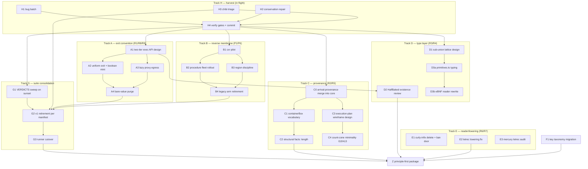

# Rework DAG — the road to a principle-first arrival package

*Companion to [`PRINCIPLES.md`](PRINCIPLES.md) (the constitution) and
[`test-suite-v2/RULINGS.md`](test-suite-v2/RULINGS.md) (the decisions). This file is the
execution plan: every node names its dependencies, its exit gate, and the agent tier that
runs it. Update node status in place as work lands.*

**Definition of done (the endgame gate, node Z):** the package is principle-first when
sunrise IS the default `test` gate, the ledger walker is green, every remaining `[INVERTS:]`
tag cites a live migration (none orphaned), chibi v2 ≥ v1 registry parity, both membrane
doors strict, exit convention uniform (R1), reverse membrane live with region discipline
(P6), and knip production-reachability clean.

## Agent tiering (the assignment rule)

- **Fable** — design, architecture, subtle semantics: anything where the *shape* of the
  answer is undecided (proxy aliasing, provenance cones, type lattices, first-of-kind
  pilots). Fable designs, then hands Sonnet a brief.
- **Sonnet** — all code execution against a written brief/design: fleets, sweeps,
  mechanical migrations, well-specified features. No-commit discipline; main thread
  verifies gates and commits.
- **Opus** — research/archaeology ONLY (read-only investigations, external surveys).
  Never writes code (observed `as any`/`as unknown` habit — exactly what P4/P5 forbid).

Standing gates for every commit: sunrise no unexpected reds · ledger walker green ·
sunset ≤ baseline · `tsc` non-test 0.

## The DAG

Critical path: **H4 → A1 → A2/A3 → A4 → G2 → G3 → Z**. Tracks B/C/D/E/F run parallel to A
once H4 lands; G2 is the convergence point (retirement can't happen while its survivor
rows cite unflipped `[INVERTS:]` tags).

## Node table

| # | Task | Agent | Depends | Exit gate |
|---|---|---|---|---|
| **H1** | Bug batch: `isSchemeValue`→`instanceof AValue`, append P5 door, parseNameDoc colon, canonicalize collisions | Sonnet *(running)* | — | ~12 it.fails flip; GAPS rows pruned |
| **H2** | Conservation repair: append/cdr container-stamp union (naive R2), DR4 box-preserving vector-map, coercion-soundness goldens | Sonnet *(running)* | — | conservation + term-carrier flips; A13 stays it.fails |
| **H3** | Chibi triage: 72× `#:let*` hygiene root cause (minimal repro REQUIRED), registry rows for remaining reds | Sonnet *(running)* | — | repro exists; cutover-gate status report |
| **H4** | Harvest: verify standing gates, commit per-agent as coherent units, explicit pathspecs | **Fable (main)** | H1–H3 | 3 commits on main, gates green |
| **A1** | Two-tier exec API design: simple ("run, get JS") wraps complex ("run, get boxed state + scope + trace"); where the tiers live, what dies (op-helpers shortcut) | **Fable** | H4 | design doc in `docs/working-proposals/`; brief for A2/A3 |
| **A2** | Uniform plain-JS exit implementation + R8 conditional boolean mint (flyweight for provenance-free, fresh ABool for stamped) | Sonnet | A1 | crossings.ts exitForm cells flip green; op-helpers shortcut deleted |
| **A3** | R9 lazy ref-tracking proxy egress: WeakMap singleton tracker, on-demand deep materialization, cycle-safe | **Fable** (proxy core) + Sonnet (test tables) | A1 | container exit rows green; aliasing law rows (shared child = same proxy) |
| **A4** | Bare-value purge: flip every `[INVERTS: bare-value-purge/P4]` retag (equality-representation family, num()/truthy() helpers, boxed-false unions) | Sonnet | A2, A3 | zero bare-value-purge tags remain in ledger index |
| **B1** | Reverse-membrane cxr pilot: cxr family → ANativeProcedure via applyCallback door, per `docs/working-proposals/reverse-membrane-for-callables.md` + §7 | **Fable** | H4 | pilot green; pattern write-up appended to proposal |
| **B2** | Procedure fleet rollout: remaining native/rosetta procedures to ACallable pattern | Sonnet fleet | B1 | all env packs on ACallable; capability RosettaSpec arm intact |
| **B3** | Region discipline: scope tokens, pending counters, escape-throws (callbacks region-bound to invocation) | Sonnet (design exists, §7) | B1 | `membrane/region.law.test.ts` it.fails flip; `[INVERTS: region-discipline/P6]` tags die |
| **B4** | Legacy arm retirement: defineRosetta legacy fixtures, migration-gated SymbolDeclaration arm (capability.ts:62-69), `[INVERTS: reverse-membrane/P1]` flips | Sonnet | B2, B3 | legacy arm deleted; zero reverse-membrane tags |
| **C0** | Merge `arrival-provenance` into core as `src/provenance/` (spine already in; remaining = analysis layer: flow-graph, lineage, statechart, slice, uneval, regions + its `__tests__`). `git mv` to preserve history; package becomes a pure re-export shim (or dies if downstream can absorb the import change). Goal: types wiring + tests visible IN core so bad provenance decisions surface instantly, not downstream | Sonnet (mechanical move) + **Fable** eyeball on seam (mobx/Observable split stays behind seams) | H4 | core `tsc` 0; provenance tests run under sunrise runners; shim re-exports only |
| **C1** | terms.ts containerBox vocabulary: R2 grouping-fact + named structural-fact fields, EXPLICIT naive strategy | Sonnet | C0 (H2's naive union) | law table names every container's facts; no emergent fields |
| **C2** | Structural facts: length PROXIED through map/sort, PROVENANCED in filter; keyset postponed | Sonnet | C1 | R2 law rows green across carriers (P8: one answer) |
| **C3** | Execution-plan wireframe design: AST → base wireframe, static wires collapse to single provenance edges, runtime wiring into abstract flow; CF-worker memory budget | **Fable** (major design) | — (parallel) | design doc; supersession plan for per-op accumulation |
| **C4** | Count-cone minimality: A13 over-attribution repair riding wireframe (or interim fix if wireframe far) | **Fable** design → Sonnet | C3 | golden-prov-fan A13 it.fails flips; G2 gate closes |
| **D1** | Sub-union lattice (R3): stratify SchemeValue into lifecycle sub-unions (EOF ∉ pair, Values/Keyword admissibility); design BEFORE mechanical guard fixes | **Fable** | H4 | lattice doc + type-level encoding proposal |
| **D2** | HalfBaked existence review (R4): earn-its-keep verdict; if stays, toJS → MaybePromise; `{__halfBaked__}` marker dies either way | **Fable** (review) → Sonnet (execute) | A1 (exec-tier interplay) | verdict recorded in RULINGS addendum; marker gone |
| **D3a** | primitives.ts phase-1: honest typing of the regex parse layer | Sonnet | D1 | tsc 0, no `as any` |
| **D3b** | primitives.ts phase-2: eBNF/grammar-driven reader replacing regex piles | **Fable** design → Sonnet build | D3a | chibi parity holds through swap |
| **E1** | Curly-infix elimination (R6): reader mode deleted, `{a * b}` explicit ban door (educational, points at dict grammar + sugarcoat), suite shrinks to ban+dict rows | Sonnet | H4 | ~40-invariant suite replaced; ban door taught message per P5 |
| **E2** | letrec lowering fix (R7): binding in scope for own initializer (s.letrec combinator / function-declaration style); drops-only law absolute | Sonnet (tight brief) | H4 | query.test.ts drops-only holds; TS2304 false-bite it.fails flips |
| **E3** | Mercury/inhuman pipeline letrec audit: same bug class? read-only investigation | Opus **or** Sonnet investigator | — (parallel) | finding report; bug filed if present |
| **F1** | Key taxonomy migration: `CLASS` → `"arrival/class"`, F3 forgery-guard law row (borrowed object's `arrival/*` data key = DATA never protocol) | Sonnet | H4 | migration + guard row green |
| **G1** | VERDICTS mechanical sweep on sunset: 8 flips, ~17 deletes, 12 rewrites, 25 retags per VERDICTS.md | Sonnet fleet | H4 | verdicts/ ledgers all marked EXECUTED |
| **G2** | v1 retirement per REMOVAL-MANIFEST survivor rules: nothing deleted without surviving home | Sonnet | G1, H3 (chibi parity), A4, B4 | every manifest row's survivor exists; chibi v2 ≥ v1 parity + >500-pass floor |
| **G3** | Runner cutover: sunrise config becomes `test`, sunset config deleted, CI gate switched | Sonnet (mechanical) | G2 | `pnpm test` = sunrise; walker enforces @ledger repo-wide |
| **Z** | Principle-first package: endgame gate audit (top of file) | **Fable (main)** | G3, C2, D2, E2, F1 | all endgame conditions checked + recorded |

## Sequencing notes

- **A before G2** — retirement is blocked while manifest survivor rows cite
  bare-value-purge tags; the purge is the long pole.
- **C3 is the one open-ended design** — start it early in background (Fable), don't gate
  anything else on it except C4. Interim A13 fix allowed if wireframe stretches.
- **B is independent of A** — reverse membrane crosses functions, exit convention crosses
  values; they meet only in crossings.ts rows (different rows).
- **D1 before mechanical guard edits** — R3's explicit instruction: lattice design first,
  then `isSchemeValue`-family fixes ride it (H1's `instanceof AValue` rewrite is the
  interim, lattice is the target).
- **Fleet discipline** — agents never commit; main thread (Fable) verifies standing gates
  and commits with explicit pathspecs, straight to main.
- **Downstream breakage is EXPECTED, not a blocker** — downstream packages (arrival-mcp,
  arrival-chain facade, arrival-manifold, …) are already partially broken from prior API
  reworks. When a task surfaces something deeply wrong in a downstream package or its
  tests: record it in [`POST-MIGRATION.md`](POST-MIGRATION.md) and KEEP GOING. Only the
  core package's standing gates block a commit. Fixing downstream is a separate
  post-migration phase, sequenced after Z.
