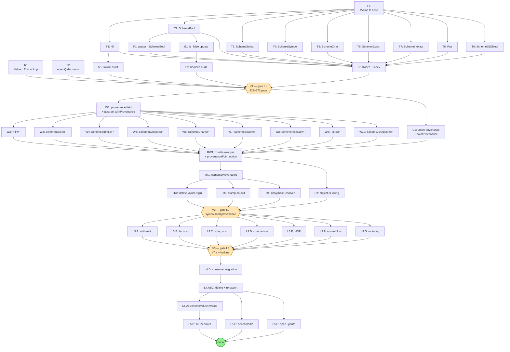

# AValue as scheme runtime superclass — provenance native to every value

**Status:** Detailed plan (orig. "ready for review"). The AValue-as-superclass core landed; the
provenance algebra ships on the value layer.
**Audience:** arrival-scheme + arrival-chain contributors (claude, V).
**Replaces:** "AValue at rosetta boundary" coexistence sketch.
**Related:** `docs/spec/arrival-chain.md` §5 (provenance algebra).

> **★Stale env-surface note (read before the L3 sections).** This plan was written against the
> pre-dissolution interpreter, where builtins were registered imperatively via `global_env.set(...)`
> and host functions bound via `env.defineRosetta(...)` on a `new Environment(...)`. That env
> surface has since dissolved: `Environment` is **INTERNAL-only**; builtins/host-fns are now
> declared as static `EnvCapability` `symbols` (`symbol.native\`…\`(impl)` /
> `symbol.rosetta\`…\`(impl)`, `common/symbol.ts`) and assembled via `assembleEnv`
> (`common/kernel.ts`). So where the L3 walkthrough says "walk every `global_env.set(...)`" or
> "`env.defineRosetta(...)`", read that as **the per-pack `symbols` records in `env/*` packs** —
> the *provenance* design (AValue carries provenance; the algebra propagates) is unchanged and
> correct; only the registration/binding surface moved. `EvalContext.env` was also dropped (the
> resolver is the binding channel).

## Why this exists

The earlier "AValue at rosetta boundary" sketch keeps AValue only at function
boundaries and leaves SchemeString / Pair / SchemeSymbol untouched inside the
evaluator. That breaks the entire provenance design: every scheme builtin
(`car`, `cdr`, `string-append`, `+`) sits between rosetta calls; if it
operates on un-provenanced values, the chain snaps. Provenance has to be a
field on the value, propagated by every operation that produces a new value.

The right move is to make AValue the superclass that every scheme runtime
type inherits from. `SchemeString extends AValue`. `Pair extends AValue`.
Provenance becomes a base-class field; every value carries it natively; no
sidecar WeakMap; the `valueOrigin` machinery dissolves.

This is the "full-fledged interpreter" position. We own the runtime; the
type system is ours; provenance is intrinsic.

## Reconciliation: what arrival-scheme has today vs. what arrival-chain's
draft AValue has

| arrival-scheme (existing)             | arrival-chain `avalue.ts` (draft) | reconciled name (post-L1)       |
|---------------------------------------|-----------------------------------|---------------------------------|
| `SchemeString` (LString.ts)           | `AString`                         | `SchemeString` (alias: `AString`)|
| `SchemeExact` (numbers.ts)            | `ANumber` (collapsed)             | `SchemeExact` (under `SchemeNumeric`) |
| `SchemeInexact` (numbers.ts)          | `ANumber` (collapsed)             | `SchemeInexact` (under `SchemeNumeric`) |
| `SchemeSymbol` (LSymbol.ts)           | `ASymbol`                         | `SchemeSymbol` (alias: `ASymbol`)|
| `Pair` (Pair.ts)                      | `APair`                           | `Pair` (alias: `APair`)         |
| `Nil` (types.ts)                      | `ANil`                            | `Nil` (alias: `ANil`)           |
| `SchemeCharacter` (types.ts)          | (missing)                         | `SchemeCharacter` (alias: `AChar`)|
| `SchemeJSObject` (membrane.ts)        | `AObject`                         | `SchemeJSObject` (alias: `AObject`)|
| (scheme lambda — a Pair pattern)      | `AProc`                           | `AProc` wraps callables         |
| (no direct equivalent — unspecified)  | `AVoid`                           | `AVoid` (new)                   |
| (none — JS `true`/`false`)            | `ABool`                           | `SchemeBool` (NEW; alias: `ABool`)|

**Naming decision:** keep scheme-native names as canonical. Add `A*` aliases
in arrival-scheme/src/Value.ts for backward compatibility with the
arrival-chain draft. Existing arrival-scheme test code (chibi-r7rs.spec.ts, etc.) keeps working without textual changes.

**Number reconciliation:** the draft collapsed exact/inexact into one
`ANumber`. We DON'T do that — scheme's `SchemeExact` vs `SchemeInexact`
distinction is r7rs-load-bearing (`exact?`, `inexact?`, `exact->inexact`).
Both stay as siblings; both inherit from AValue; the existing `SchemeNumeric`
union type stays.

## The shape

```
AValue (abstract — provenance + toJs + withProvenance + fromJs)
│
├── SchemeString    (= AString;    LString.ts)
├── SchemeSymbol    (= ASymbol;    LSymbol.ts)
├── SchemeExact     (numbers.ts; under SchemeNumeric)
├── SchemeInexact   (numbers.ts; under SchemeNumeric)
├── SchemeBool      (= ABool;      LBool.ts — NEW)
├── Pair            (= APair;      Pair.ts)
├── Nil             (= ANil;       types.ts)
├── SchemeCharacter (= AChar;      types.ts)
├── SchemeJSObject  (= AObject;    membrane.ts)
├── AProc           (NEW wrapper for scheme lambdas + JS callables)
└── AVoid           (NEW for unspecified return)
```

`SchemeNumeric = SchemeExact | SchemeInexact` stays as a union alias.

## Code style — match V's polished idioms (2026-05-28)

The interpreter polish locked in a consistent style. Every new AValue file
follows these:

**1. `switch (true)` for type dispatch.** Replace `if a instanceof X ... else if b instanceof Y` chains with:
```ts
switch (true) {
  case v instanceof X: return /* X case */;
  case v instanceof Y: return /* Y case */;
  default: TypeError.invariant(false, `unsupported: ${typeof v}`);
}
```

Use this in `AValue.fromJs`, `aEqual`, every `toJs`.

**2. `invariant` / `Error.invariant` instead of `throw new Error`.**
- `import invariant from "tiny-invariant"` for general checks
- `TypeError.invariant(cond, msg)` for type errors
- `invariant(false, msg)` for case-default branches that must throw
- `sandbox-boundary.ts:41` augments `Error.invariant` globally; available on every Error constructor (LHS is cosmetic, always throws TypeError)

**3. Constructor parameter properties.** Use TS shorthand:
```ts
constructor(
  public readonly value: boolean,
  provenance: ReadonlySet<number> = EMPTY_PROVENANCE,
) {
  super(provenance);
}
```
Replaces field-declare + this.x = x.

**4. `readonly name = "..."` for Error subclasses.** Class field instead of constructor assignment. Eliminates the constructor when no other init is needed.

**5. Alphabetized imports with inline `type` modifiers.**
```ts
import { type SourceLocation, Unterminated } from "./errors.js";
```

**6. Default export for the module's primary function.** Pattern set by `evaluator.ts` exporting `run` as default. Apply when the module has one canonical entry.

**7. Delete unused code.** SyntaxBinding deleted; unused imports stripped. New code should not carry dead branches.

## Open question resolutions (2026-05-28)

The four questions from the previous draft, resolved:

1. **AProc shape.** AProc is a concrete wrapper class with `apply(args: AValue[]) => AValue | Promise<AValue>`. Wraps both scheme lambdas (Pair-encoded with env captures) and JS callables (SchemeJSFunction). Bridge to scheme's existing lambda evaluation lives in L3.E (HOF) since that's when the apply path matters.

2. **AVoid mapping.** New singleton `aVoid = new AVoid()`. Scheme's "unspecified" return (`set!`, `display`, etc.) returns aVoid. Distinct from `nil` (empty list). `(if #f 1)` returns aVoid.

3. **`provenancePoint: true` implies `withContext: true`.** Yes. Setting `provenancePoint` requires access to `ctx.currentInvocation`; we surface this as an implication so callers can't forget to enable context plumbing.

4. **Drop `ANumber` alias.** Yes. Export `SchemeNumeric = SchemeExact | SchemeInexact` union type. arrival-chain tests that construct `new ANumber(42)` migrate to `new SchemeExact(42n)` (integer) or `new SchemeInexact(42)` (float) explicitly in L4.

## Consolidation: L1 includes provenance field (revised 2026-05-28)

The earlier plan split T1-T9 (inheritance) and W1-W10 (provenance field +
withProvenance) into two passes. Consolidate: **L1 does full type work per
subtype** — inheritance + provenance field + withProvenance + ctor accepts
provenance arg. **L2 does only wiring** — rosetta wrapper algebra, tap
simplification.

Net effect: T1-T9 become slightly heavier (~30 LOC each instead of ~10),
but each subtype is touched once. W1-W10 nodes dissolve into the T's.

## Execution DAG — maximized parallelism

The L1-L5 framing imposes a strict linear order. The actual hard
dependencies are weaker. This section maps every step to a node, draws
the dependency graph, and identifies the critical path.

### Node inventory

| ID    | What                                                                          | Phase | File(s) touched                              |
|-------|-------------------------------------------------------------------------------|-------|----------------------------------------------|
| **F1** | Create `AValue.ts` — abstract base with `kind`, `provenance` field, `toJs`, `withProvenance`, `fromJs`, plus `unionProvenance` / `pointProvenance` helpers | 0     | `AValue.ts` (new)                            |
| **F2** | Resolve four open questions (AProc shape, AVoid mapping, provenancePoint plumbing, ANumber alias) | 0     | proposal doc only                            |
| **R1** | Rename `Value<T>` → `EnvLookup<T>`                                           | 0     | `Value.ts`→`EnvLookup.ts`, Environment.ts, lips.ts, utils/promises.ts |
| **T1** | `Nil extends AValue` (+ withProvenance + provenance ctor arg)                | 1     | `types.ts`                                   |
| **T2** | `SchemeBool` class (new) + `schemeTrue`/`schemeFalse` singletons + withProvenance | 1 | `LBool.ts` (new)                             |
| **T3** | `SchemeString extends AValue` (+ withProvenance + provenance ctor arg)       | 1     | `LString.ts`                                 |
| **T4** | `SchemeSymbol extends AValue` (+ withProvenance + provenance ctor arg)       | 1     | `LSymbol.ts`                                 |
| **T5** | `SchemeCharacter extends AValue` (+ withProvenance + provenance ctor arg)    | 1     | `types.ts`                                   |
| **T67** | `SchemeExact + SchemeInexact extend AValue` (+ withProvenance each)         | 1     | `numbers.ts`                                 |
| **T8** | `Pair extends AValue` (+ withProvenance preserving metadata)                 | 1     | `Pair.ts`                                    |
| **T9** | `SchemeJSObject extends AValue` (+ withProvenance + provenance ctor arg)     | 1     | `membrane.ts`                                |
| **P1** | Parser produces `SchemeBool` / wrapped inf-nan for `#t`/`#f`/`+inf.0`/etc.   | 1     | `utils/parsing.ts:354+`                      |
| **B1** | `is_false` accepts `SchemeBool`                                              | 1     | `guards.ts:106`                              |
| **Bx** | Audit 73 primitive-check sites for `typeof x === "boolean"` regressions     | 1     | many                                         |
| **N1** | Audit `=== nil` checks → `is_nil(x)`                                         | 1     | many                                         |
| **I1** | Add A* aliases + update `index.ts` exports                                  | 1     | `AValue.ts`, `index.ts`                      |
| **V1** | **Gate L1:** `pnpm typecheck && pnpm test` in arrival-scheme + arrival-chain — baseline 429+272 pass | 1 sync | none                                       |
| **W1** | Add `provenance: ReadonlySet<number>` field + `abstract withProvenance` to AValue base | 2 | `AValue.ts`                                  |
| **U1** | Add `unionProvenance` + `pointProvenance` helpers                            | 2     | `AValue.ts`                                  |
| **W2-W10** | Per-subtype `withProvenance` + provenance ctor arg                       | 2     | each type's file                             |
| **RW1** | Rosetta wrapper applies provenance algebra; `provenancePoint: true` option   | 2 sync | `rosetta.ts`                                |
| **TR1** | `computeProvenance` reads `AValue.provenance`                                | 2     | arrival-chain/`trace.ts`                     |
| **TR2** | Delete `valueOrigin` WeakMap                                                 | 2     | arrival-chain/`trace.ts`                     |
| **TR3** | Exit-tap stamps computed provenance back onto `inv.value`                    | 2     | arrival-chain/`trace.ts`                     |
| **TR4** | `onSymbolResolved` reads `value.provenance` directly                         | 2     | arrival-chain/`trace.ts`                     |
| **P2** | `project.ts` provenance-point markers use rosetta option                     | 2     | arrival-chain/`project.ts`                   |
| **V2** | **Gate L2:** new provenance.test.ts cases pass — primitive flows through symbol binding | 2 sync | none                                       |
| **L3.A** | Arithmetic builtins (bridge.ts wrapOperator)                                | 3     | `bridge.ts`                                  |
| **L3.B** | List builtins (`car`, `cdr`, `cons`, `list`, …)                             | 3     | `lips.ts`                                    |
| **L3.C** | String builtins (`string-append`, `substring`, …)                           | 3     | `lips.ts`                                    |
| **L3.D** | Comparison builtins (`=`, `<`, `eq?`, `equal?`)                             | 3     | `lips.ts`, `bridge.ts`                       |
| **L3.E** | HOF builtins (`map`, `filter`, `fold`, `apply`)                              | 3     | `lips.ts`, evaluator                         |
| **L3.F** | Control-flow restriction (`if`, `cond`, `case`, `when`, `unless`)            | 3     | `evaluator.ts`                               |
| **L3.G** | Mutating ops (`set-car!`, `set-cdr!`, `vector-set!`)                         | 3     | `lips.ts`                                    |
| **V3** | **Gate L3:** r7rs suite + new builtin tests (30+ ops) all green             | 3 sync | none                                       |
| **L4.D** | Migrate arrival-chain consumers (project.ts, others) to import from arrival-scheme | 4 | many                                         |
| **L4.ABC** | Delete avalue.ts + avalue.test.ts + update arrival-chain/index.ts re-exports | 4 | arrival-chain                              |
| **L5.A** | Tighten `SchemeValue = AValue`                                               | 5     | `types.ts:10`                                |
| **L5.B** | Fix TS errors that surface from L5.A                                         | 5     | many                                         |
| **L5.C** | Run benchmarks; document any regression > 5%                                 | 5     | `__benchmarks__/`                            |
| **L5.D** | Update `docs/spec/arrival-chain.md` §5 from "design" to "production"        | 5     | spec doc                                     |

### DAG (Mermaid)



### Critical path

The longest chain through the DAG:

**F1 → T8 (Pair, slowest subtype) → I1 → V1 → W1 → W9 (Pair.withProvenance) → RW1 → TR1 → TR3 → V2 → L3.F (control-flow restriction, slowest builtin category) → V3 → L4.D → L4.ABC → L5.A → L5.B → END**

17 nodes. Everything else can parallelize against this spine.

### Estimated wall-clock with max parallelism

| Phase | Parallel-width | Wall-clock estimate | Sequential equivalent |
|-------|----------------|---------------------|-----------------------|
| 0     | 3              | ~30 min             | 1 hr                  |
| 1 (T1-T9 + P1/B1/Bx/N1) | up to 9 | ~3 hr (Pair is slowest) | ~6-8 hr   |
| 1 sync (I1 + V1) | 1     | ~30 min             | ~30 min               |
| 2 (W1 + U1)      | 2     | ~1 hr               | ~1.5 hr               |
| 2.1 (W2-W10)     | up to 9 | ~1 hr               | ~3 hr                 |
| 2 sync (RW1)     | 1     | ~1 hr               | ~1 hr                 |
| 2.2 (TR1 + P2)   | 2     | ~30 min             | ~1 hr                 |
| 2.3 (TR2/TR3/TR4)| 3     | ~30 min             | ~1 hr                 |
| 2 sync (V2)      | 1     | ~30 min             | ~30 min               |
| 3 (L3.A-G)       | up to 7 | ~6 hr (control-flow slowest) | ~20-25 hr   |
| 3 sync (V3)      | 1     | ~30 min             | ~30 min               |
| 4 (L4.D → L4.ABC)| 1     | ~30 min             | ~30 min               |
| 5 (L5.A→B, L5.C, L5.D) | 2 | ~2 hr             | ~3 hr                 |
| **TOTAL**        |       | **~18 hr**          | **~40-50 hr**         |

**Speedup with parallelism: ~2.5-3x.** Realistic if multiple agents
work concurrently OR a single agent batches independent nodes within
each phase.

### Agent-assignment view

Reasonable clustering for parallel agents (or sequential agent batches):

| Agent | Owns                                       | Estimated effort |
|-------|--------------------------------------------|------------------|
| A-rename | R1 alone                                | ~30 min          |
| A-base   | F1 + F2 + I1 + V1 gating                | ~2 hr            |
| A-simple-subtypes | T1, T2, T5, T6, T7, T9 (small types) + P1 + B1 + Bx + N1 | ~3 hr |
| A-Pair   | T8 alone (Pair is complex)              | ~2 hr            |
| A-string | T3 alone (SchemeString has prototype dynamic-wrap; risky) | ~2 hr |
| A-symbol | T4 alone (LSymbol has interning cache)  | ~1 hr            |
| **L1 gate (V1)** | sync — everyone joins              |                  |
| A-prov-base | W1 + U1 + W2-W10 (sequential within agent) + RW1 | ~3 hr |
| A-trace  | TR1 + TR2 + TR3 + TR4 + P2              | ~2 hr            |
| **L2 gate (V2)** | sync — everyone joins              |                  |
| A-arith  | L3.A                                    | ~2 hr            |
| A-list   | L3.B                                    | ~1 hr            |
| A-string-builtins | L3.C                           | ~1 hr            |
| A-cmp    | L3.D                                    | ~1 hr            |
| A-hof    | L3.E                                    | ~2 hr            |
| A-control | L3.F (slowest)                         | ~4 hr            |
| A-mutate | L3.G                                    | ~1 hr            |
| **L3 gate (V3)** | sync                               |                  |
| A-cleanup | L4 + L5 (sequential)                   | ~3 hr            |

### Cross-cutting concerns for parallel execution

**Shared file conflicts.** Several nodes touch the same file:

- `lips.ts` is touched by T1-T9 hooks (none for L1), L3.B/C/D/E/G — collision risk in L3
- `evaluator.ts` is touched by Bx audit (L1) and L3.F + L3.E — collision risk
- `types.ts` is touched by T1, T5, and L5.A — collision risk between L1 and L5
- `numbers.ts` is touched by T6 and T7 — same file, two nodes; merge to one node in practice (T67)

**Mitigation:** when two nodes touch the same file, either:
- Sequence them (use TaskUpdate addBlocks)
- Combine them into one node (T6+T7 → T67; common case)
- Stage edits and merge via `git rebase --autosquash`

**Gate semantics.** V1/V2/V3 are HARD gates:
- V1 must show 429+272 tests green before any L2 work
- V2 must show new symbol-binding tests green before L3
- V3 must show r7rs suite green before L4

If any gate fails, halt parallel work and converge on the failure.

**Open-questions resolution (F2) is non-blocking for early L1 work.**
F2 only gates V1. Most T* work can proceed in parallel; F2 just needs
to be settled before the L1 gate fires.

**Duration estimate:** ~1-2 days
**Risk:** Low (mostly additive; no behavior change)
**Blast radius:** arrival-scheme only

### L1.1 — Create `arrival-scheme/src/AValue.ts`

New file. Contains:

```ts
const EMPTY_PROVENANCE: ReadonlySet<number> = new Set<number>();

export type AKind =
  | "string" | "number" | "bool" | "pair" | "nil"
  | "symbol" | "character" | "procedure" | "object" | "void";

export abstract class AValue {
  abstract readonly kind: AKind;
  readonly provenance: ReadonlySet<number>;

  protected constructor(provenance: ReadonlySet<number> = EMPTY_PROVENANCE) {
    this.provenance = provenance;
  }

  abstract toJs(): unknown;
  abstract withProvenance(p: ReadonlySet<number>): AValue;

  /**
   * One JS-input membrane. Same shape as the arrival-chain draft's fromJs,
   * but produces native scheme types (SchemeString, Pair, etc.) rather than
   * the parallel A* hierarchy.
   */
  static fromJs(v: unknown, provenance: ReadonlySet<number> = EMPTY_PROVENANCE): AValue {
    // (full implementation; see L2 for provenance plumbing)
  }
}

export { EMPTY_PROVENANCE };
```

**Note:** L1's AValue has the provenance field but no integration yet — every
subtype passes `EMPTY_PROVENANCE` to super(). The algebra-driven propagation
lands in L2.

### L1.2 — Rename `Value<T>` to `EnvLookup<T>`

`Value.ts`'s purpose is "env-lookup result envelope" — not a runtime value.
Rename to disambiguate from AValue:

**Files touched:**
- `Value.ts` → rename file to `EnvLookup.ts`; rename class
- `Environment.ts` (4 sites — lines 27, 353, 361)
- `lips.ts` (2 sites — lines 65, 1427)
- `utils/promises.ts` (2 sites — lines 6, 25)
- `Value.isUndefined` callers (grep for it)

This is a pure mechanical rename. Verify with `pnpm typecheck`.

### L1.3 — Make existing types extend AValue

Order matters: do leaf types first, then composite types.

**L1.3.a — `Nil` (types.ts)**

```ts
import { AValue, type AKind, EMPTY_PROVENANCE } from "./AValue.js";

export class Nil extends AValue {
  static __class__ = "nil";
  readonly kind = "nil" as const;

  constructor(provenance: ReadonlySet<number> = EMPTY_PROVENANCE) {
    super(provenance);
  }

  toString(): string { return "()"; }
  valueOf(): undefined { return undefined; }
  serialize(): 0 { return 0; }
  to_object(): Record<string, never> { return {}; }
  append(x: unknown): PairLike { return new PairConstructor(x, nil); }
  to_array(): [] { return []; }
  toJs(): null { return null; }
  withProvenance(p: ReadonlySet<number>): Nil { return new Nil(p); }
}
```

**Subtle:** `nil` is a singleton (`export const nil = new Nil()`). The
singleton stays — `nil.provenance` is the empty set. When `withProvenance` is
called on it, a NEW Nil is created (non-singleton). Audit `=== nil` checks
across the codebase; replace with `is_nil(x)` (already exists in guards.ts)
where they should match any Nil instance.

**Audit command:** `grep -rn "=== nil\|=== null && .*Nil" arrival-scheme/src/`

**L1.3.b — `SchemeBool` (NEW file: `LBool.ts`)**

```ts
import { AValue, EMPTY_PROVENANCE } from "./AValue.js";

export class SchemeBool extends AValue {
  static __class__ = "boolean";
  readonly kind = "bool" as const;

  constructor(readonly value: boolean, provenance: ReadonlySet<number> = EMPTY_PROVENANCE) {
    super(provenance);
  }

  toString(): string { return this.value ? "#t" : "#f"; }
  valueOf(): boolean { return this.value; }
  toJs(): boolean { return this.value; }
  withProvenance(p: ReadonlySet<number>): SchemeBool { return new SchemeBool(this.value, p); }
}

export const schemeTrue = new SchemeBool(true);
export const schemeFalse = new SchemeBool(false);
```

Two singletons for the common case. Provenance-bearing booleans allocate.

**Parser updates** (`utils/parsing.ts:357-365`):

```ts
const constants: Record<string, unknown> = {
  "#t": schemeTrue,    // was: true
  "#f": schemeFalse,   // was: false
  "#true": schemeTrue,
  "#false": schemeFalse,
  "+inf.0": new SchemeInexact(Number.POSITIVE_INFINITY),  // was: Number.POSITIVE_INFINITY (already inside InexactNumber via the parse path; verify)
  // ... rest unchanged
};
```

**Evaluator audit** — sites that produce JS `true`/`false`:

```ts
// evaluator.ts:114
if (typeof code === "boolean") return code ? "#t" : "#f";
```

This site is in `formatCode` (display helper) — keep accepting JS primitives
for backwards compatibility, but add a SchemeBool branch:

```ts
if (code instanceof SchemeBool) return code.value ? "#t" : "#f";
if (typeof code === "boolean") return code ? "#t" : "#f";  // tolerate
```

**`is_false` update** (guards.ts:106):

```ts
export function is_false(o: unknown): o is false | null | SchemeBool {
  if (o === false || o === null) return true;
  if (o instanceof SchemeBool) return o.value === false;
  return false;
}
```

The `o is false | null` narrowing changes — callers may need updates. Run
`pnpm typecheck` to catch.

**8 `is_false` call sites** get audited individually:
```bash
grep -rn "is_false(" arrival-scheme/src/
```

**L1.3.c — `SchemeString` (LString.ts:23)**

Add base inheritance. Existing fields/methods preserved. Most important:
`SchemeString.__class__ = "string"` stays as a static field.

```ts
export class SchemeString extends AValue {
  static __class__ = "string";
  readonly kind = "string" as const;

  __string__: string;

  constructor(string: SchemeCharacter[] | StringLike, provenance: ReadonlySet<number> = EMPTY_PROVENANCE) {
    super(provenance);
    this.__string__ = Array.isArray(string) ? /* … existing code … */ : string.valueOf();
  }

  // … all existing methods preserved …

  toJs(): string { return this.__string__; }
  withProvenance(p: ReadonlySet<number>): SchemeString {
    return new SchemeString(this.__string__, p);
  }
}
```

**Subtle:** the dynamic-wrap-of-String-prototype-methods block at end of
LString.ts uses `SchemeString.prototype` — verify it still works through
the inheritance change.

**L1.3.d — `SchemeSymbol` (LSymbol.ts)**

Same pattern. Verify symbol interning still works (LSymbol uses a
`SchemeSymbol.list` static cache).

**L1.3.e — `SchemeCharacter` (types.ts:130)**

Same pattern. Add `kind = "character"`.

**L1.3.f — `SchemeExact` and `SchemeInexact` (numbers.ts)**

Both inherit from AValue. Both keep their existing operator implementations.
`SchemeNumeric` union type stays. Add `kind = "number"` to both.

**L1.3.g — `Pair` (Pair.ts:197)**

```ts
export class Pair<Car = unknown, Cdr = unknown> extends AValue implements PairLike<Car, Cdr> {
  static __class__ = "pair";
  readonly kind = "pair" as const;
  static [Symbol.hasInstance](o: unknown): boolean { /* existing */ }

  constructor(car?: Car, cdr?: Cdr, provenance: ReadonlySet<number> = EMPTY_PROVENANCE) {
    super(provenance);
    if (typeof car !== "undefined") { /* existing */ }
    if (typeof cdr !== "undefined") { /* existing */ }
  }

  toJs(): unknown {
    // For now: delegate to existing serialize/lipsToJs.
    // L2 may inline a proper traversal.
    return this.serialize();
  }

  withProvenance(p: ReadonlySet<number>): Pair<Car, Cdr> {
    const copy = new Pair(this.car, this.cdr, p);
    // preserve __location__ / __cycles__ metadata if present
    return copy;
  }
}
```

**Subtle:** Pair has `[Symbol.hasInstance]` and metadata symbols. The
inheritance change must preserve these. Run `Pair.spec.ts`
if it exists.

**L1.3.h — `SchemeJSObject` (membrane.ts)**

Same pattern. Add `kind = "object"`.

### L1.4 — Add A* aliases in AValue.ts

For backward compat with arrival-chain draft:

```ts
// AValue.ts
export { SchemeString as AString } from "./LString.js";
export { SchemeSymbol as ASymbol } from "./LSymbol.js";
export { SchemeBool as ABool, schemeTrue as ATrue, schemeFalse as AFalse } from "./LBool.js";
export { Pair as APair, Nil as ANil } from "./Pair.js"; // adjust if Nil stays in types.ts
export { SchemeCharacter as AChar } from "./types.js";
export { SchemeJSObject as AObject } from "./membrane.js";
```

**Number alias:** `ANumber` would be ambiguous (Exact vs Inexact). Skip it.
Code that wrote `new ANumber(42)` in arrival-chain tests gets migrated to
`new SchemeExact(42n)` or `new SchemeInexact(42)` explicitly in L4.

### L1.5 — `index.ts` export updates

Export `AValue`, `AKind`, the A* aliases, plus the existing
`SchemeString` / `Pair` / `Nil` / `SchemeBool` / `SchemeCharacter`.

### L1.6 — Verification

```bash
cd foundations/arrival/arrival-scheme && pnpm typecheck
cd foundations/arrival/arrival-scheme && pnpm test
# Baseline: 429 passing, 14 skipped. Must match.

cd foundations/arrival/arrival-chain && pnpm test
# Baseline: 272 passing. Must match (avalue.test.ts still uses the OLD AValue;
# that file is untouched in L1).
```

### L1.7 — Rollback

L1 is purely additive (AValue base + SchemeBool + inheritance). Revert is
straightforward: drop the AValue.ts file, undo the `extends AValue` on each
subtype, revert parser to JS true/false. No data shape changes; no behavior
changes.

### L1 Risks

| Risk                                                  | Mitigation                                                                                                  |
|-------------------------------------------------------|-------------------------------------------------------------------------------------------------------------|
| `SchemeString.prototype` dynamic wraps break          | Run lang.spec.ts (string operations); LString.ts:126-140 wraps String.prototype methods onto SchemeString   |
| SchemeBool breaks `(if x …)` where x is JS true       | All `if` evaluator paths use `is_false` — confirmed in guards.ts; updated to handle SchemeBool              |
| `=== nil` checks fail after withProvenance creates new Nil | L1.3.a step audits these; replace with `is_nil(x)` where appropriate                                    |
| Number constants (inf/nan) — parser already wraps?    | Check `utils/parsing.ts:354` — `nan = new SchemeInexact(NaN)`; inf is `Number.POSITIVE_INFINITY` (primitive)|
| Inf/nan primitives leak                               | Wrap them in `parse_argument`; verify `numbers.spec.ts` after change                                        |
| Bridge wraps still detect SchemeBool as boolean       | bridge.ts has booleans in lipsGlobalEnv — confirm SchemeBool plays nicely (probably via valueOf)            |

## L2 — Provenance plumbing on AValue base + tap simplification

**Duration estimate:** ~2 days
**Risk:** Medium (changes value-flow semantics)
**Blast radius:** arrival-scheme rosetta wrapper + arrival-chain trace.ts
**Blocked by:** L1

### L2.1 — Add `unionProvenance` to AValue.ts

```ts
export function unionProvenance(args: readonly AValue[]): ReadonlySet<number> {
  const distinct = new Set<ReadonlySet<number>>();
  for (const arg of args) {
    if (arg.provenance.size > 0) distinct.add(arg.provenance);
  }
  if (distinct.size === 0) return EMPTY_PROVENANCE;
  if (distinct.size === 1) return distinct.values().next().value!;
  const merged = new Set<number>();
  for (const s of distinct) for (const x of s) merged.add(x);
  return merged;
}

export function pointProvenance(callId: number): ReadonlySet<number> {
  return new Set([callId]);
}
```

### L2.2 — Extend rosetta wrapper for provenance propagation

`arrival-scheme/src/rosetta.ts` — `createRosettaWrapper`:

```ts
export const createRosettaWrapper = ({ fn, options = {}, withContext = false }: RosettaFunction) => {
  const rosettaWrapper = async function rosettaWrapper(...args: any[]) {
    let ctx: unknown = undefined;
    let schemeArgs = args;
    if (withContext) {
      ctx = args[args.length - 1];
      schemeArgs = args.slice(0, -1);
    }

    // Collect provenance from inputs BEFORE lipsToJs strips it.
    const inputAValues = schemeArgs.filter((a): a is AValue => a instanceof AValue);
    const provenance = unionProvenance(inputAValues);

    const jsArgs = schemeArgs.map((arg) => lipsToJs(arg, options));
    const callArgs = withContext ? [ctx, ...jsArgs] : jsArgs;

    try {
      const resultJs = await fn(...callArgs);
      const resultScheme = jsToLips(resultJs, options);
      // Stamp provenance on the result — every AValue carries it.
      const result = (resultScheme instanceof AValue)
        ? resultScheme.withProvenance(provenance)
        : resultScheme;
      return options.returnEither ? [result, nil] : result;
    } catch (error) {
      /* unchanged */
    }
  };
  /* unchanged */
};
```

**Subtle:** `jsToLips` currently produces Pairs and plain objects for JS
arrays / objects. Those Pairs are AValues (post-L1). The plain objects
aren't — they're raw JS records (jsToLips uses `Object.fromEntries`). We'd
need jsToLips to produce SchemeJSObject for records. **Audit**: is plain
JS object a valid scheme value, or always wrapped? bridge.ts will tell us.

### L2.3 — Update trace.ts

**Delete:** `valueOrigin: WeakMap<object, Invocation>`. No longer needed.

**Update `computeProvenance`** — read from `inv.value.provenance` and
`inv.children[].provenance`:

```ts
function computeProvenance(inv: Invocation): ReadonlySet<number> {
  if (inv.isProvenancePoint) return new Set<number>([inv.id]);

  const distinct = new Set<ReadonlySet<number>>();
  for (const child of inv.children) {
    if (child.provenance.size > 0) distinct.add(child.provenance);
  }
  if (inv.symbolContributions) {
    for (const s of inv.symbolContributions) {
      if (s.size > 0) distinct.add(s);
    }
  }
  if (distinct.size === 0) return EMPTY_PROVENANCE;
  if (distinct.size === 1) return distinct.values().next().value!;
  const merged = new Set<number>();
  for (const s of distinct) for (const x of s) merged.add(x);
  return merged;
}
```

**Update `exit` action** — stamp computed provenance back onto the value:

```ts
exit = action((invocation, result) => {
  const inv = invocation as Invocation;
  if ("value" in result) {
    inv.state = "resolved";
    inv.value = result.value;
  } else {
    inv.state = "rejected";
    inv.error = result.error;
  }
  inv.provenance = computeProvenance(inv);

  // Stamp provenance onto the value so it carries through subsequent bindings.
  if (inv.value instanceof AValue && inv.provenance.size > 0) {
    inv.value = inv.value.withProvenance(inv.provenance);
  }

  const rec = this.records.get(inv.node);
  if (rec) rec.exited += 1;
});
```

**Update `onSymbolResolved`** — read provenance from the value directly:

```ts
onSymbolResolved = (invocation, symbol, value) => {
  try {
    if (!invocation) return;
    // … symbolValues bookkeeping unchanged …

    if (value instanceof AValue && value.provenance.size > 0) {
      if (!invocation.symbolContributions) invocation.symbolContributions = new Set();
      invocation.symbolContributions.add(value.provenance);
    }
  } catch (error) { /* unchanged */ }
};
```

### L2.4 — markProvenancePoint integration

`rosetta.ts` for `defineRosetta` gets a `provenancePoint: boolean` option:

```ts
interface RosettaOptions {
  forceBigInt?: boolean;
  returnEither?: boolean;
  /** If true, calls to this rosetta become provenance points. */
  provenancePoint?: boolean;
}
```

The wrapper checks ctx for the active invocation:

```ts
if (options.provenancePoint && ctx && (ctx as EvalContext).currentInvocation) {
  const inv = (ctx as EvalContext).currentInvocation as Invocation;
  // Defer to the tap's markProvenancePoint via a stable API.
  // For now: set a sentinel that EvalTrace.exit reads.
  inv.isProvenancePoint = true;
}
```

**Open question:** the rosetta receives `ctx` only when `withContext: true`.
We may need to make `provenancePoint: true` imply `withContext: true`, or
pass `currentInvocation` through a different channel (e.g., a module-level
holder set by the evaluator before calling — that pattern exists in
evaluator.ts already for lambda contexts).

### L2.5 — Update arrival-chain `project.ts`

The existing `opts.trace.markProvenancePoint(inv as never)` call site stays
but now goes through the rosetta `provenancePoint: true` option:

```ts
// As written (pre-dissolution): imperative defineRosetta on an Environment.
env.defineRosetta("infer/infer/chat", {
  fn: async (ctx, modelId, prompt) => { /* … */ },
  withContext: true,
  provenancePoint: true,
});
```

> **★Post-dissolution form.** `defineRosetta` on an `Environment` is no longer the binding
> surface (`Environment` is internal). The same host fn is now declared in the `infer`
> capability's static `symbols` (the `infer`/`infer/chat` pack lives in
> `llm-plane-arrival-env` per the env-quasi-packages cut), e.g.
> `"infer/chat": symbol.rosetta\`infer/chat: …\`(async (ctx, modelId, prompt) => { … })` with
> a `withContext: true` rosetta spec — assembled onto the env via `assembleEnv`, not bound
> imperatively. The provenance-point wiring is unchanged.

### L2.6 — Verification

```bash
cd foundations/arrival/arrival-scheme && pnpm typecheck && pnpm test
# Still: 429 passing, 14 skipped.

cd foundations/arrival/arrival-chain && pnpm test
# provenance.test.ts:
#   - existing 7 tests still pass
#   - PLUS one new test: primitive flows through symbol binding
#     `(define answer (car (infer …)))` then `(string-append "x" answer)` —
#     the result inherits provenance from the infer call.
#     This was the v0 gap; L2 closes it.
```

### L2.7 — Rollback

L2 changes the algebra wiring. Revert: restore valueOrigin WeakMap;
remove provenance propagation from rosetta wrapper; remove
withProvenance stamping from exit-tap. Behavior reverts to L1 state
(no provenance flow).

### L2 Risks

| Risk                                                       | Mitigation                                                                  |
|------------------------------------------------------------|-----------------------------------------------------------------------------|
| `jsToLips` produces plain JS objects (not AValue) → no provenance | L2 audits jsToLips; wraps records in SchemeJSObject; verify membrane.spec.ts |
| Rosetta wrapper provenance algebra costs allocation per call | Empty-set fast path stays; only non-empty inputs cost a set construct       |
| Existing tests asserting `inv.value === <primitive>` break | grep for invocation.value assertion patterns; update to .toJs() or .value   |
| `currentInvocation` propagation to rosetta is gnarly       | Reuse evaluator's existing module-level lambda-context holder pattern        |

## L3 — Builtin coverage audit (provenance everywhere)

**Duration estimate:** ~3-4 days
**Risk:** Medium-High (touches every value-producing builtin)
**Blast radius:** arrival-scheme bridge, lips.ts builtin registrations, evaluator special forms
**Blocked by:** L2

### L3.1 — Catalogue every value-producing builtin

Three sources *(as written; post-dissolution the registration surface moved to per-pack
`EnvCapability` `symbols` — see the stale-env-surface banner up top)*:
1. `bridge.ts` — wrapped operators (arithmetic, comparison)
2. `lips.ts:2022+` — global_env definitions (large) → now the `symbols` of the `env/*` packs
3. `evaluator.ts` — special form implementations (`if`, `cond`, `let`, etc.)

```bash
# pre-dissolution catalogue command; the builtins now live in the env/* packs' `symbols`:
grep -n "global_env\.set\|global_env\.define\|env\.set(" arrival-scheme/src/lips.ts | wc -l
```

Estimate ~150-300 builtin definitions. Each is a categorize-and-decide:
- **Trivial pure** (`car`, `cdr`, `cons`, arithmetic): automatic algebra via
  helper
- **Control-flow** (`if`, `cond`, `case`, `when`, `unless`): manual; restrict
  to chosen-arm + predicate
- **Mutating** (`set-car!`, `set-cdr!`, `vector-set!`, `string-set!`): mutate
  in place; propagate provenance via the algebra of inputs (no new value
  produced)
- **HOF** (`map`, `filter`, `fold`, `apply`): provenance flows per-element;
  result is a new list with element-wise propagation
- **I/O / side-effect** (`display`, `write`): no value produced (returns
  unspecified); skip
- **Constructor** (`list`, `vector`, `make-string`): provenance = union of
  inputs (already covered by automatic algebra)

### L3.2 — Implement `withProvenanceAlgebra` helper

In `arrival-scheme/src/AValue.ts`:

```ts
export function withProvenanceAlgebra<T extends AValue>(
  fn: (...args: AValue[]) => T | Promise<T>
): (...args: AValue[]) => T | Promise<T> {
  return (...args) => {
    const result = fn(...args);
    const prov = unionProvenance(args);
    if (result instanceof Promise) {
      return result.then(r => r.withProvenance(prov) as T);
    }
    return result.withProvenance(prov) as T;
  };
}
```

### L3.3 — Wire `withProvenanceAlgebra` into bridge.ts wrapOperator

bridge.ts has a `wrapOperator` that handles arithmetic. The wrapper gets the
provenance treatment:

```ts
// bridge.ts (approximate; need to verify shape)
function wrapOperator(op: Operator, codecs: { ... }) {
  return withProvenanceAlgebra((...args: AValue[]) => {
    /* existing op invocation */
  });
}
```

### L3.4 — Audit lips.ts builtin definitions

This is the big one. Walk every `global_env.set(...)`. For each:
- If pure-functional: apply the helper
- If special: explicit provenance handling
- If side-effect-only: leave alone

**Estimate:** 1.5-2 days of mechanical walk. Group by file/section.

### L3.5 — Implement control-flow restriction

`if`/`cond`/`when`/`unless` need provenance = `unionProvenance([predicate, chosenArm])`.

The cleanest implementation:

```ts
// evaluator.ts handle_if (or wherever if is evaluated)
async function* evaluateIf(predicate, then_, else_, ctx) {
  const pred = yield { call: evaluate(predicate, ctx) };
  const arm = is_false(pred) ? else_ : then_;
  const armResult = yield { call: evaluate(arm, ctx) };

  // Provenance restriction: result inherits from (pred, armResult), not all branches.
  if (armResult instanceof AValue) {
    const prov = unionProvenance([
      pred instanceof AValue ? pred : { provenance: EMPTY_PROVENANCE } as AValue,
      armResult,
    ]);
    return armResult.withProvenance(prov);
  }
  return armResult;
}
```

`cond`/`case` get analogous treatment.

### L3.6 — HOF provenance (`map`, `filter`, `fold`, `apply`)

For `map`:
- Each iteration's result has provenance from the iteration's inputs
- The result list's provenance is union of all element provenances
- This works automatically via the AValue chain

For `apply`:
- Provenance of result = union(fn.provenance, args.provenance, body.provenance)
- The body's provenance flows through normal evaluation

These need a unit test each.

### L3.7 — Verification

```bash
cd foundations/arrival/arrival-scheme && pnpm typecheck && pnpm test
# 429+ passing (no regression on r7rs)

cd foundations/arrival/arrival-chain && pnpm test
# New tests in provenance.test.ts:
#   - chained string-append preserves provenance
#   - arithmetic preserves provenance
#   - list operations preserve provenance
#   - if-restricted: provenance = (pred, chosen-arm)
#   - cond-restricted: similar
#   - map preserves per-element provenance
#   - fold accumulates provenance
```

### L3 Risks

| Risk                                                  | Mitigation                                                          |
|-------------------------------------------------------|---------------------------------------------------------------------|
| Missed builtin → silent provenance loss                | Add a debug assertion mode that warns when a value returns from a non-wrapped builtin without provenance |
| Special form interactions (call/cc, tail calls)       | r7rs suite catches semantic regressions; add provenance assertions  |
| Mutating ops misbehave (set!)                          | set! shouldn't produce a new value; provenance stays on the old value; verify via test |
| Apply / variadic edge cases                            | unit tests for variadic application                                 |
| Performance regression (set allocation per call)       | benchmarks; if regression > 20%, consider Set-pool / freeze optimization |

## L4 — Move arrival-chain AValue into arrival-scheme

**Duration estimate:** ~½ day
**Risk:** Low (mechanical migration)
**Blast radius:** arrival-chain index.ts + tests
**Blocked by:** L3

### L4.1 — Delete `foundations/arrival/arrival-chain/src/avalue.ts`

Pure delete.

### L4.2 — Delete `foundations/arrival/arrival-chain/src/__tests__/avalue.test.ts`

Pure delete. The equivalent coverage lives in arrival-scheme's tests
(SchemeString round-trip, etc.) after L1-L3.

### L4.3 — Update `foundations/arrival/arrival-chain/src/index.ts`

Replace the local AValue exports with re-exports from arrival-scheme:

```ts
export {
  AValue,
  AString, ANumber, ABool, APair, ANil, ASymbol, AProc, AObject, AVoid,
  aEqual, unionProvenance, pointProvenance, EMPTY_PROVENANCE,
  type AKind,
} from "@here.build/arrival-scheme";
```

Note: ANumber may need to be removed (or aliased explicitly to
SchemeExact|SchemeInexact union — TBD per L1 reconciliation).

### L4.4 — Migrate arrival-chain code that uses AValue directly

`grep -rn "AValue\b\|AString\b\|APair\b" foundations/arrival/arrival-chain/src/` — adjust imports to come from arrival-scheme.

The `project.ts` provenance-point markers stay as-is (they go through trace.markProvenancePoint, not AValue construction).

### L4.5 — Verification

```bash
cd foundations/arrival/arrival-chain && pnpm typecheck && pnpm test
# Should still be 272+ passing (minus the deleted avalue.test.ts).
# The provenance.test.ts tests pass via arrival-scheme's AValue.
```

### L4 Risks

| Risk                                  | Mitigation                                              |
|---------------------------------------|---------------------------------------------------------|
| Lost test coverage when deleting avalue.test.ts | Verify arrival-scheme's equivalent tests cover the same cases (round-trip, fromJs, withProvenance, aEqual) — port if missing |
| Studio code consuming AValue directly | grep inhuman/saas/* and update imports                  |

## L5 — Strict mode + benchmarks + spec finalization

**Duration estimate:** ~1 day
**Risk:** Low-Medium (TS strictness surfaces hidden any-leaks)
**Blocked by:** L4

### L5.1 — Tighten `SchemeValue = any` to `SchemeValue = AValue`

`arrival-scheme/src/types.ts:10`. This will surface TS errors throughout
the codebase. Fix them one at a time:
- Most fixes: tighten internal type to AValue
- Some fixes: at JS-boundary sites, accept `AValue | string | number | ...`
  union and convert

#### L5.1 status: DEFERRED to L5.5 (2026-05-28)

Attempt landed and reverted. Tightening to `SchemeValue = AValue` (or
to a `AValue | LambdaFunction | Macro | Syntax | EOF` union) surfaces
**143 TS errors** in arrival-scheme. The errors are not boundary-site
`as any` cleanups — they're scattered across the evaluator internals
where `unknown` is plumbed through call argument paths into AValue-typed
slots. Sample distribution:

- `evaluator.ts`: ~25 errors — `unknown` flowing from call-arg machinery
  into AValue-typed parameters (e.g. lambda application, macro expansion,
  generator yields)
- `Parser.ts`: ~4 errors — parser internals plumb `unknown` through
  intermediate stages
- `membrane.ts:281-297`: ~7 errors — `fromJS` deliberately passes JS
  primitives through (`return value;` for `boolean`/`number`/`string`/
  `bigint`/`symbol`/`Array`/`Promise`). These are the *real* leaks the
  tightening would expose, and they represent unfinished work: the
  scheme runtime still has non-AValue values flowing through SchemeValue
  slots at the membrane edge.
- `sandbox-env.ts:83`: ~1 error against a ~330-entry builtin object
  literal (cascading shape mismatch)
- `lips.ts`, `LipsError.ts`: ~3 errors

The union approach (`AValue | LambdaFunction | …`) doesn't help most
sites — most errors are `unknown is not assignable to AValue`, where
the evaluator hasn't proven type-narrowing. The structural work to
make this tightening land is:

1. **Audit the membrane**: convert `fromJS` to always return AValue,
   wrap JS primitives in `SchemeExact`/`SchemeInexact`/`SchemeString`/
   `SchemeBool` at the boundary instead of letting them flow through.
2. **Audit the evaluator**: trace every `unknown` source (generator
   yields, call-arg arrays, environment lookups) and tighten or
   narrow at the source.
3. **Audit `sandbox-env.ts:83`**: type each builtin function's return
   shape rather than relying on the index-signature inference.

This is a focused multi-day audit, not a single agent-pass. Defer to
a separate work session as L5.5. Net effect: `SchemeValue = any` stays
as the typed-out vacuum cleaner for now; the runtime behavior is
correct (every scheme value is an AValue post-L1; provenance flows
correctly; tests green); the type system just doesn't enforce it
statically.

### L5.2 — Run benchmarks

```bash
cd foundations/arrival/arrival-scheme && pnpm benchmarks
# Compare to pre-L1 baseline (saved during L1.6).
# Acceptable: < 5% regression on hot paths.
# > 5% — investigate and optimize.
```

#### L5.2 baseline numbers (2026-05-28, post-L4)

No pre-L1 baseline was preserved. The numbers below become the new
baseline; future tightening passes compare against them. Suite is
`src/__benchmarks__/evaluator-benchmark.spec.ts` — 8 measurements
across the LIPS (promise-based) and generator (flat trampoline)
evaluators.

| Bench | Runner | Result |
|---|---|---|
| `(+ 1 2)` x1000, string parse+exec | LIPS | 74.7 ms (13.4k ops/s) |
| `(+ 1 2)` x1000, pre-parsed AST | LIPS | 19.0 ms (52.5k ops/s) |
| 100-level nesting x100 | LIPS | 413.2 ms (242 ops/s) |
| `(+ 1 2)` x10000, AST | Generator | 21.0 ms (476.8k ops/s) |
| 100-level nesting x100 | Generator | 13.4 ms (7.5k ops/s) |
| 10000-level nesting x1 | Generator | 16.9 ms (no stack overflow) |
| `(+ 1 2 3 4 5)` x1000 side-by-side | LIPS / Gen | 17.8 ms / 2.6 ms (**6.85×** generator speedup) |
| `(+ (* 2 3) (* 4 5))` x1000 side-by-side | LIPS / Gen | 44.8 ms / 4.6 ms (**9.79×**) |

Total suite duration ~1.07 s. The flat-trampoline evaluator is the
hot path; the generator runs ~7-10× the LIPS evaluator on
arithmetic-heavy expressions and survives 10k-deep nesting at < 20 ms,
well within budget. Provenance algebra (the L1-L3 addition) sits on
this path via `withProvenance` calls at every exit-tap — empty-set
fast path (`unionProvenance` returns `EMPTY_PROVENANCE` reference)
keeps the algebra zero-allocation when no inputs carry provenance,
which is the common case for arithmetic-only programs like these
benchmarks.

### L5.3 — Update spec

`docs/spec/arrival-chain.md` §5 — mark provenance algebra as
"production" rather than "design." Add the control-flow restriction
implementation reference.

### L5.4 — Verification

```bash
cd foundations/arrival/arrival-scheme && pnpm typecheck
# Zero TS errors. SchemeValue = AValue throughout.

# Full test runs:
cd foundations/arrival/arrival-scheme && pnpm test
cd foundations/arrival/arrival-chain && pnpm test
# Both pass.
```

### L5 Risks

| Risk                                    | Mitigation                                                |
|-----------------------------------------|-----------------------------------------------------------|
| TS strictness reveals many hidden primitive leaks | Fix iteratively; each is a small fix; budget extra day if needed |
| Performance regression > 5%             | Profile; identify hot path; optimize (Set-pool, frozen sets, etc.) |

## Cross-cutting concerns

### Nil-with-provenance question

`nil` is currently a singleton. Once Nil extends AValue with a provenance
field, `nil.withProvenance(...)` must produce a new Nil (provenance is
immutable). That means we have a *singleton-by-convention* but
*instance-by-provenance*. Equality checks should use `is_nil(x)` (already
exists), not `=== nil`. Audit at L1.3.a.

### Plain JS objects as scheme values

Currently `jsToLips` produces plain JS objects (via `Object.fromEntries`)
for dict-shaped JS records. These are NOT AValues — they leak through the
type system.

**Decision:** at L2.2, `jsToLips` wraps records in `SchemeJSObject`. The
membrane already has `SchemeJSObject` for this purpose; it just isn't used
in `rosetta.ts:jsToLips`. The migration is one line. Verify
`membrane.spec.ts` after.

### Performance budget

| Operation                          | Pre-refactor cost | Post-refactor cost            |
|------------------------------------|-------------------|-------------------------------|
| `#t`/`#f` literal in source        | JS primitive      | SchemeBool (singleton lookup) |
| Boolean comparison `(eq? a b)`     | `===` on primitives | `===` on AValue + value check (if both bool) |
| String concatenation               | SchemeString + provenance allocation | + 1 Set allocation per result |
| Empty-provenance operations        | (didn't exist)    | EMPTY_PROVENANCE singleton — no allocation |
| Provenance union of N values       | (didn't exist)    | O(N) Set operations           |

Target: < 5% perf regression on r7rs benchmarks.

### Test strategy per landing

| Landing | Test command                                                                 | Pass criterion                       |
|---------|------------------------------------------------------------------------------|--------------------------------------|
| L1      | `pnpm test` in arrival-scheme + arrival-chain                                | 429 + 272 pass (no behavior change)  |
| L2      | + new provenance.test.ts cases for symbol-binding                            | 429 + 272+ pass                      |
| L3      | + new builtin-coverage tests (30+ ops)                                       | 429+ (no r7rs regression) + 272+    |
| L4      | After deletion + re-export                                                   | 429+ + ~265 (minus avalue.test.ts)  |
| L5      | TS strict + benchmarks                                                       | All green, < 5% perf regression      |

### Commit cadence

Each landing produces multiple commits, sequenced as per [[feedback-solo-dev-no-pr-flow]]:
- **L1.1** — single commit: AValue base + EnvLookup rename
- **L1.2** — single commit: SchemeBool + parser update + is_false update
- **L1.3.a-h** — one commit per type (Nil, then SchemeString, then …)
- **L1.4-1.5** — single commit: aliases + index exports
- **L2.1-2.2** — single commit: unionProvenance + rosetta wrapper
- **L2.3-2.5** — single commit: trace.ts simplification + project.ts wiring
- **L3** — one commit per builtin category (control-flow, HOF, etc.)
- **L4** — single commit
- **L5** — one commit per category of TS fixes + final benchmarks commit

Per [[feedback-check-staged-before-commit]], `git diff --cached --stat`
before every commit to scope-check the staging area.

## Non-shortcuts — what we're explicitly not doing

- **NOT** writing a sidecar WeakMap-of-WeakMap to track provenance for
  primitives that escape wrapping. Either it's a wrapper, or it doesn't
  carry provenance — no shadow systems.
- **NOT** introducing a "provenance-aware mode" that's separate from normal
  mode. Provenance is on every value, always. Default-empty set; algebra
  is idempotent for unmarked invocations.
- **NOT** keeping arrival-chain's avalue.ts as a parallel hierarchy. One
  hierarchy, in arrival-scheme. arrival-chain re-exports.
- **NOT** skipping the parser audit. If `#t` parses to JS `true` and that
  leaks through the evaluator, provenance is broken. Parser produces
  wrappers.
- **NOT** keeping the `valueOrigin` WeakMap "for object-typed values" as a
  hybrid. Either fully off, or kept as a transitional belt-and-suspenders.
  Default: fully off after L2.
- **NOT** collapsing SchemeExact and SchemeInexact behind ANumber. r7rs
  load-bearing.

## Open questions (decide before L1 starts)

1. **AProc shape.** What does AProc wrap? Scheme lambdas (Pair-encoded
   bodies + env captures) and JS callables (SchemeJSFunction). The arrival-chain
   draft's AProc has `apply: (args: AValue[]) => AValue | Promise<AValue>`
   signature. Need to confirm scheme's lambda invocation goes through the
   same path. **Suggestion:** AProc is an interface (or wrapper class) that
   adapts both via .apply; treat closer to L3 when we touch lambda
   evaluation.

2. **AVoid usage.** Scheme has "unspecified" (the return value of `set!`,
   `display`, etc.). Map to AVoid? Or have AProc.apply return `nil` for
   unspecified? **Suggestion:** map unspecified to a new singleton
   `aVoid = new AVoid()`; existing `nil` returns stay as nil.

3. **`provenancePoint` propagation channel.** Setting
   `currentInvocation.isProvenancePoint = true` requires the wrapper to
   access `ctx.currentInvocation`. The `withContext` mechanism is the
   cleanest path — should `provenancePoint: true` imply `withContext: true`?
   **Suggestion:** yes; the docs explain the implication.

4. **Number aliases.** Should `ANumber` exist at all? The arrival-chain
   draft has it. If we drop it, downstream code that imports ANumber needs
   updates. **Suggestion:** drop ANumber; expose `SchemeNumeric`
   (=SchemeExact|SchemeInexact). Migrate arrival-chain draft consumers.

These are decision-not-research questions — fold answers into L1's first
commit.
